Title: Bienvenue à l'Autre Net 
Date: 2011-06-03 09:02:11
Category: 01. Bienvenue 
Tags: old
Summary: Vous êtes en train de créer un compte et vous souhaitez publier sur internet. Les pages qui suivent pourraient vous aider

Vous venez de créer un compte et vous souhaitez publier sur internet. Les pages qui suivent ont pour but

- de vous faire faire un premier « tour de la maison » 
- traiter d'un cas très simple : publier une première page sur internet.

L'objectif est de vous montrer le B.A  BA, en supposant que vous n'y connaissez pas grand chose.  
*(Donc, les geeks, passez votre chemin, sauf si vous avez des suggestions « constructives » ;-) )*.

Pour les exemples présentés dans cette aide, nous avons créé un compte ayant pour nom **bonvenon**. C'est le "nom\_du\_compte" ou le "login" ou le "nomdevotrecompte" ou "Utilisateur" que nous avons choisi lors de notre inscription lors de l'étape 4 ("login souhaité").  
*(Dans les pages de cette documentation vous rencontrerez selon le cas un de ces trois termes utilisés. Dans ce texte,* **bonvenon** *est à remplacer par le "nom de votre compte".)*  

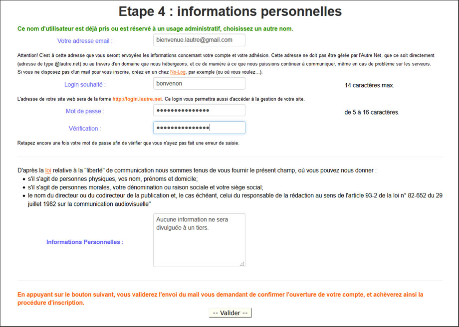  

(illustration 1)  
      
Après l'étape 4 vous avez reçu un mail vous invitant à confirmer la création de votre compte sur lautre.net. En cliquant sur le lien contenu dans ce mail votre navigateur ouvre un nouvel onglet confirmant le création du compte.  
  
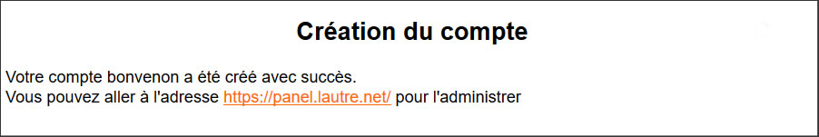  

(illustration 2)  
   

Votre compte est maintenant validé vous pouvez vous connecter sur l'interface de gestion.   

Le login n'est pas modifiable par la suite. C'est ce login (ou nom\_du\_compte) qui nous permet de [nous connecter au bureau de gestion de notre hébergement](https://panel.lautre.net/)  

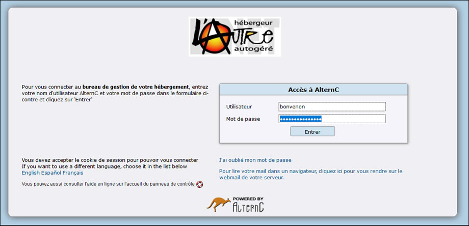

(illustration 3)  
  

## Un tour de la maison

Nous arrivons sur le panneau de gestion de notre compte.   

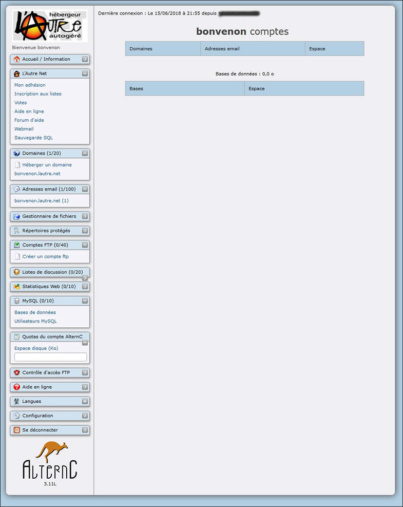

(illustration 4)  
  

nous pouvons constater, dans la colonne de gauche que nous avons déjà :

- un domaine : *bonvenon*.lautre.net ;
- une adresse mail associé à notre domaine ;

Nous avons aussi, mais cela ne se voit pas dès l'arrivée dans l'interface :

- un emplacement prêt à recevoir les fichiers de notre site : www\.*bonvenon*.lautre.net ;

Nous avons déjà un **« domaine »** *(par commodité de langage on parle de domaine et sous-domaine en prenant comme référence le point de départ dans l'arborescence. Si nous considérons* **lautre.net** *comme un domaine, alors*  **bonvenon.lautre.net** *est un sous-domaine, mais si nous considérons que* **bonvenon.lautre.net** *est le domaine alors*  **www\.bonvenon.lautre.net** *est un sous-domaine.)*.  

En créant notre compte, et tel qu'il est dit dans la [page d'accueil de notre association](https://lautre.net/) «chaque membre de l’Autre Net dispose d'un  sous-domaine en lautre.net (nomdevotrecompte.lautre.net)». C'est le Login souhaité que nous avons indiqué (voir illustration 1). Nous avons maintenant un sous-domaine : *bonvenon*.lautre.net, comme on le voit dans la zone entourée.   

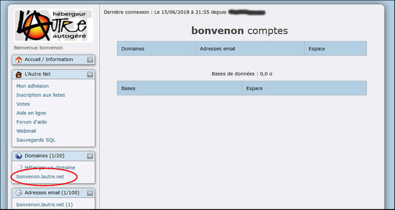

(illustration 5)  
   

Saisissons ce nom de domaine dans la barre d'adresse de notre navigateur.   
    
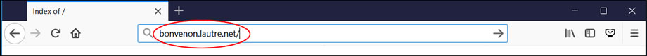

(illustration 6)  
   

Après validation nous obtenons :    

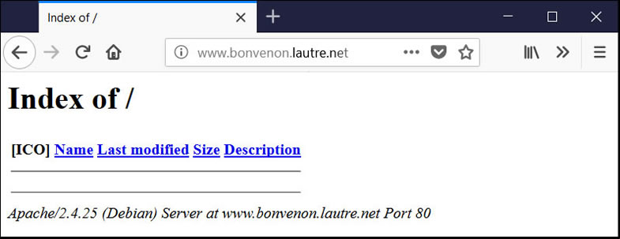

(illustration 7)  
   

Nous avons maintenant un **www\.** qui est apparu dans l'adresse. La page nous affiche **"Index of /"**

Pour comprendre revenons à l'interface, et étudions de plus près notre domaine, en cliquant sur son nom "*bonvenon*.lautre.net" (l'ovale rouge de l'illusatrion 5).   
  
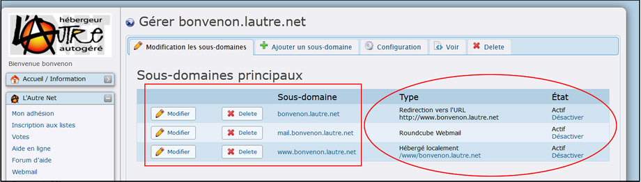

(illustration 8)  
   

Dans la partie droite de l'interface il y a une liste en deux parties : sur la gauche (carré rouge) notre domaine  *bonvenon*.lautre.net et ses sous-domaines, et à droite (ovale rouge) à quoi ils correspondent. Etudions de plus prêt le domaine *bonvenon*.lautre.net en cliquant sur le premier bouton "Modifier" représentant un crayon à gauche du nom de domaine. 

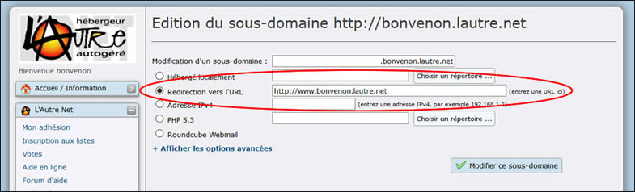

(illustration 9)  
 

Ce sous-domaine est redirigé vers une autre adresse (un autre sous-domaine) qui est http://www\.*bonvenon*.lautre.net. Voilà pourquoi quand nous avons tapé http://*bonvenon*.lautre.net.nous avons vu apparaître http://www\.*bonvenon*.lautre.net.

Qu'il y a-t-il derrière http://www\.*bonvenon*.lautre.net ? Si nous revenons en arrière, puis cliquons cette fois-ci sur le crayon à coté de www\.*bonvenon*.lautre.net, nous avons :

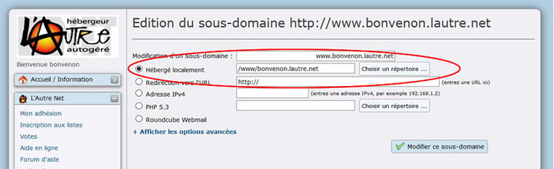

(illustration 10)  
   

Il est indiqué que ce sous-domaine est « géré en local », autrement dit que les documents sont sur le serveur de l'Autre Net, et nous voyons leur localisation dans le dossier /www/*bonvenon*.lautre.net/ (nous verrons cela plus tard dans cette aide).  
    
    
>[NDLR] : Pourquoi ce sac de nœuds entre *bonvenon*.lautre.net à www\.*bonvenon*.lautre.net ?  
C'est que nous avons des roots (ce sont les nounous qui font que nos serveurs tournent) très organisés.

>Dans le système de noms de domaine, un nom de domaine (NDD en notation abrégée française ou DN pour Domain Name en anglais) est un identifiant de domaine internet. 

>Pour simplifier, un nom de domaine est un « raccourci » faisant référence à une adresse IP. Le but d'un nom de domaine est de retenir facilement l'adresse d'un site. Par exemple, lautre.net est plus simple à mémoriser que 80.67.160.91. 

>Le système de nom de domaine est hiérarchique, permettant la définition de sous-domaines. 

>Le terme domaine désigne habituellement un domaine de deuxième niveau. Voici quelques noms de domaine valides : wikipedia.org, paris.fr,  louvre.museum, yaourt.biz et lautre.net. 

>Il est possible de définir des sous-domaines dans un domaine. **L'un des sous-domaines les plus répandus est « www »**, mais il est possible d'utiliser n'importe quelle suite de caractères satisfaisant les conditions générales de rédaction des noms de domaine. Par exemple, tour-eiffel.paris.fr est un sous-domaine de paris.fr, et *bonvenon*.lautre.net est un sous-domaine de lautre.net. 

Donc nos roots préparent déjà le domaine « normal » du web : **www\.**

Nous avons déjà un nom de domaine, mais en plus...

**Nous avons déjà un emplacement prêt à recevoir les documents de notre site.**

A gauche dans l'écran d'accueil de l'interface (illustration 4), nous avons le choix "Gestionnaire de fichiers" :
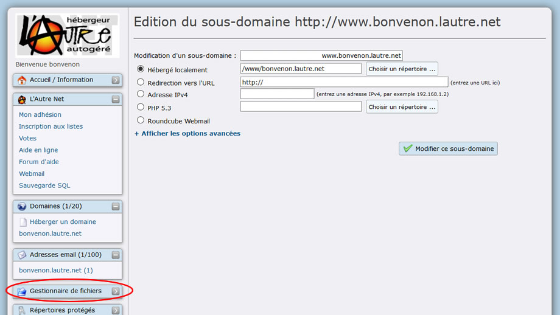

(illustration 11)  
   

Si on clique dessus :

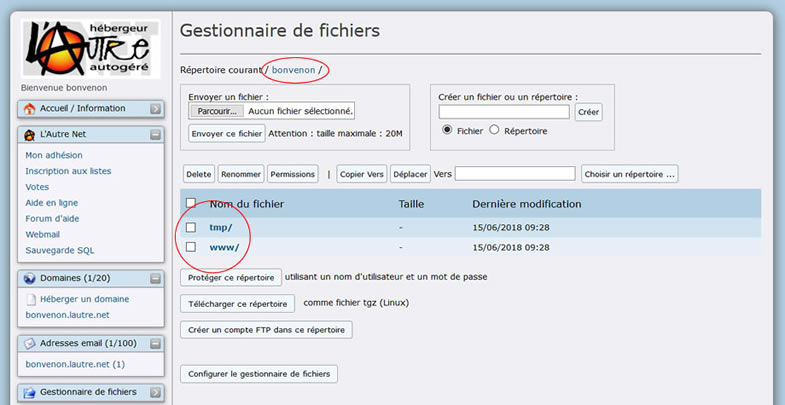

(illustration 12)  
   

nous voyons dans l'illustration 12 que dans notre espace de travail */bonvenon/* (ovale rouge), qui est la « racine » de notre site, se trouvent déjà deux répertoires (Un répertoire c'est un dossier. Dans le Gestionnaire des fichiers les répertoires sont indiqués par un nom suivi d'un /) tmp/ et www/.  
Cliquons sur le lien www/ (c'est-à-dire sur son nom) :  

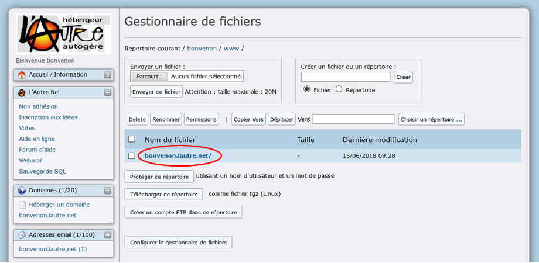

(illustration 13)  
   

Ce répertoire (illustration 13) contient un autre répertoire : *bonvenon*.lautre.net/. Cliquons sur son nom :

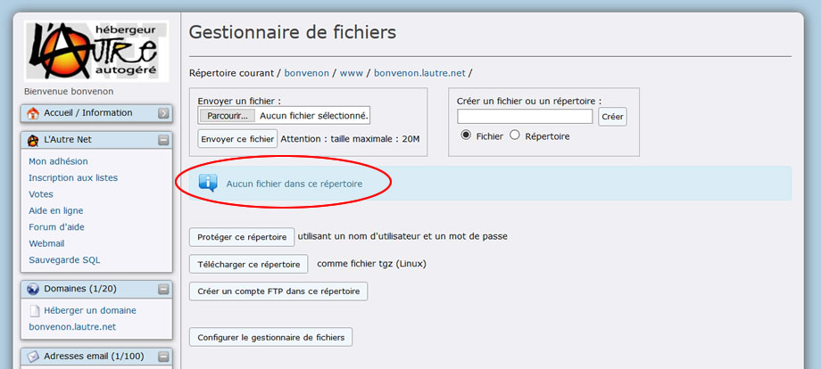

(illustration 14)  
   

Ce répertoire (illustration ci-dessus) est vide.

Donc, lorsque nous avons tapé dans la barre adresses du navigateur *bonvenon*.lautre.net nous avons été redirigés vers http://www\.*bonvenon*.lautre.net, ce domaine est hébergé  « en local » dans le répertoire /*bonvenon*/www/*bonvenon*.lautre.net/.

Il n'y a pas de document (fichier) dans ce dossier (répertoire). C'est pour cela que notre navigateur affiche "**Index of /**" et rien d'autre. Le navigateur suit le cheminement que nous avons fait, puis affiche ce qu'il y a : rien, liste vide.

**Nous avons déjà un compte ftp**.

Pour échanger des fichiers entre notre espace d'hébergement et notre ordinateur nous pouvons :

- le faire directement à partir de l'interface, mais uniquement dans le sens notre ordinateur vers notre espace d'hébergement.[C'est expliqué dans la documentation](http://aide.lautre.net/04-import-de-fichiers-et-ftp.html) et plus loin dans ce document ;
- utiliser le [protocole de transfert de fichiers ftp](https://fr.wikipedia.org/wiki/File_Transfer_Protocol) grâce à un logiciel spécialisé tel que [FileZilla](http://www.filezilla.fr/) par exemple (Il existe de nombreux logiciels permettant d'effectuer des transferts de fichiers utilisant le protocole FTP).  
Pour cela nous avons besoin d'un « compte ftp » permettant la connexion au travers de ce protocole.  
**Ce compte ftp est déjà prêt**.  

Cliquons sur le choix « liste des comptes ftp » dans l'interface :  

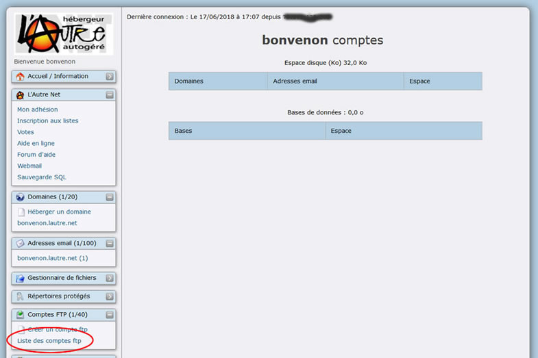

(illustration 15)  
 

Nous obtenons

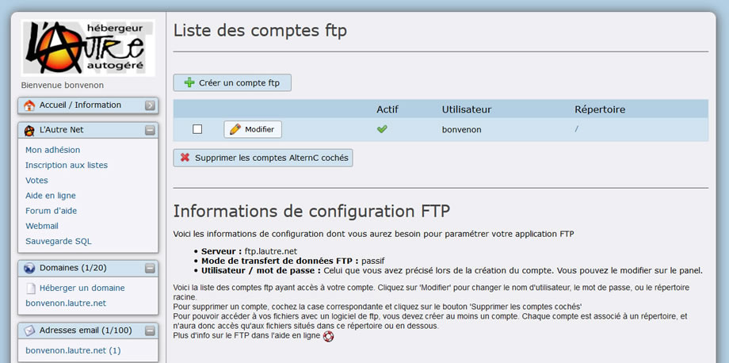 
>
(illustration 16)  
   

Nous voyons qu'il existe un compte ayant pour nom d'utilisateur *bonvenon* et qui « pointe » sur la racine (le tout premier répertoire) de notre espace d'hébergement, c'est à dire "/". Ce compte par défaut a le même mot de passe que notre compte (celui que nous utilisons pour nous connecter à l'interface).

>NDLR: SI ce n'est pas le cas, et que vous souhaitez utiliser le protocole FTP il faut créer un compte.
>Pour cela cliquer sur le lien "Créer un compte ftp"
>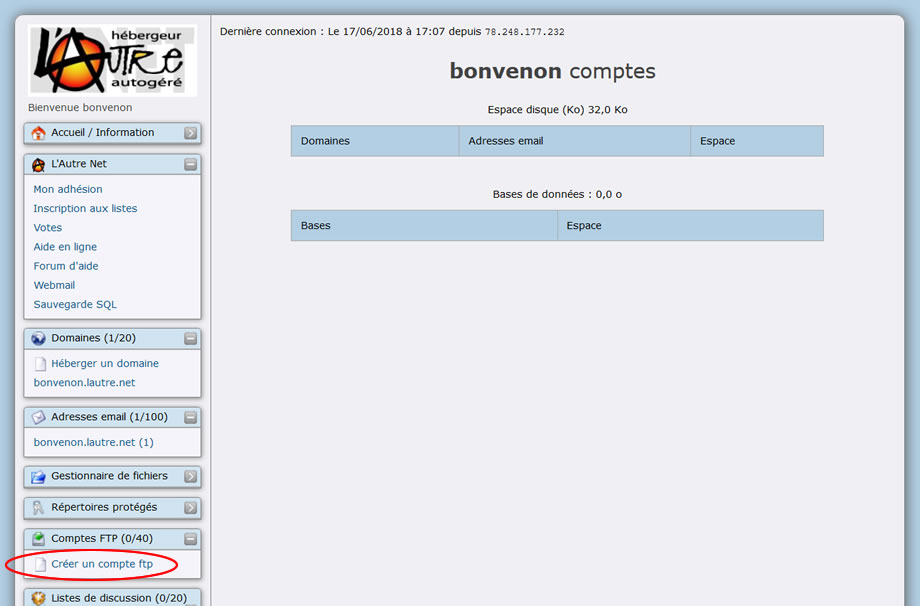  
>
(illustration 17)  
  
>Il suffit de taper deux fois le mot de passe (ovale rouge), puis de cliquer sur le bouton "Enregistrer" (rectangle rouge).  
ASTUCE : utlilisez le même mot de passe que celui de votre compte lautre.net.  
>
>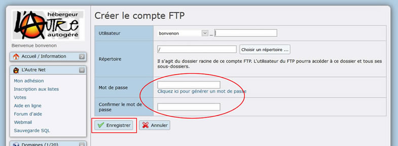 
>
(illustration 18)  
   
>Nous possédons maintenant un compte FTP.  
  
**Nous avons déjà un compte mail.**

Lors de la création du compte à l'Autre Net un compte mail par défaut est crée, attaché à notre domaine *bonvenon*.lautre.net :   

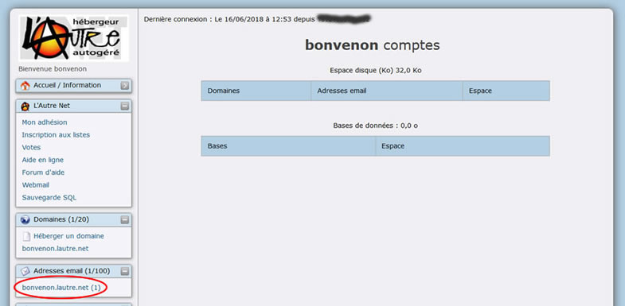

(illustration 19)  
  

En cliquant sur le lien (ovale rouge dans l'illustration ci-dessus) nous obtenons :

(illustration 20)  
 

nous voyons que ce compte mail par défaut est *bonvenon*@*bonvenon*.lautre.net, Pour voir ses caractéristiques cliquer sur le bouton "Modifier" représentant un crayon (ovale rouge dans l'illustration ci-dessus) :

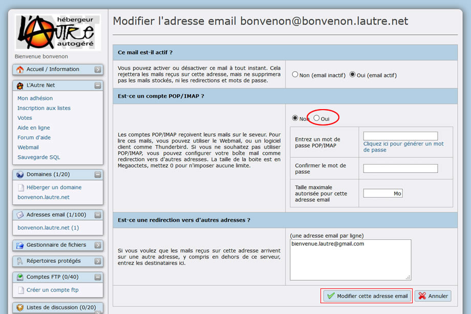

(illustration 21)  
 

nous constatons qu'il y a déjà une redirection des mails vers l'adresse que nous avons fourni en remplissant le formulaire d'adhésion. Donc, par défaut, les mails qui sont envoyés à *bonvenon*@*bonvenon*.lautre.net vont arriver à notre adresse de contact, qui est aussi celle que nous utilisons pour participer à notre assemblée générale permanente.

Mais comment lire directement les messages adressés à *bonvenon*@*bonvenon*.lautre.net ? Comme il est indiqué dans cette page, « vous pouvez consulter votre boîte au lettres par webmail » 

- en tapant l'adresse http://mail\.*bonvenon*.lautre.net/ dans la barre d'adresse de votre navigateur.
- avec pour identifiant *bonvenon*@*bonvenon*.lautre.net et pour mot de passe celui de votre compte.
**Mais il faut au préalable avoir coché "Oui" (illustration 21)**,  cochez le bouton radio 'oui' (ovale rouge) puis cliquer sur le bouton "Modifier cette adresse email" (rectangle rouge). **Sinon ça marchera pas**. Nous pouvons aussi par la même occasion changer le mot de passe, mais c'est optionnel.   

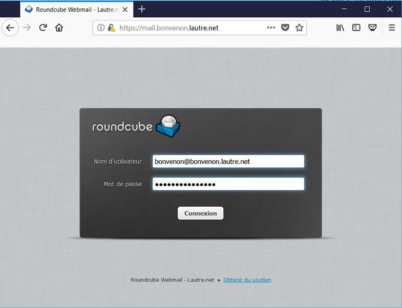

(illustration 22)  
 

>NDLR: SI l'adresse mail n'a été générée automatiquement, vous pouvez la créer.
>Pour cela cliquer sur le lien "*bonvenon*.lautre.net (0)" (Ovale rouge ci-dessous).  
>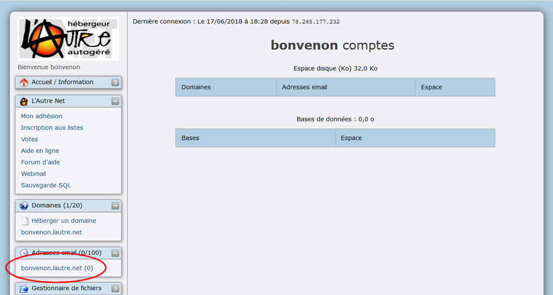  
>
(illustration 23)  
  
>Taper votre nom de compte avant @*bonvenon*.lautre.net (ovale orange) puis cliquer sur le bouton "Ajouter cette adresse email" (rectangle rouge)  
>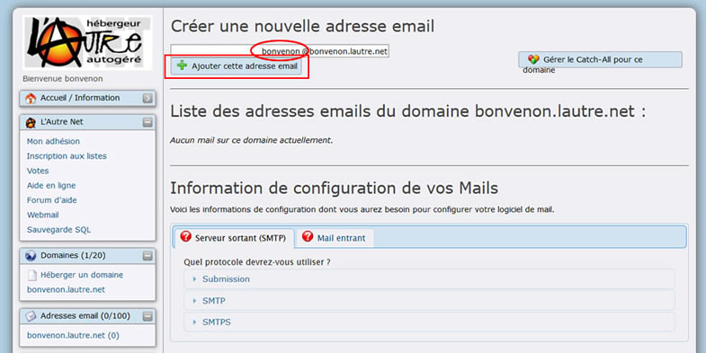  
>
(illustration 24)  
   
>
>Saisir votre adresse de contact (ovale orange) puis cliquer sur le bouton "Modifier cet adresse email" (rectangle rouge)  
>
>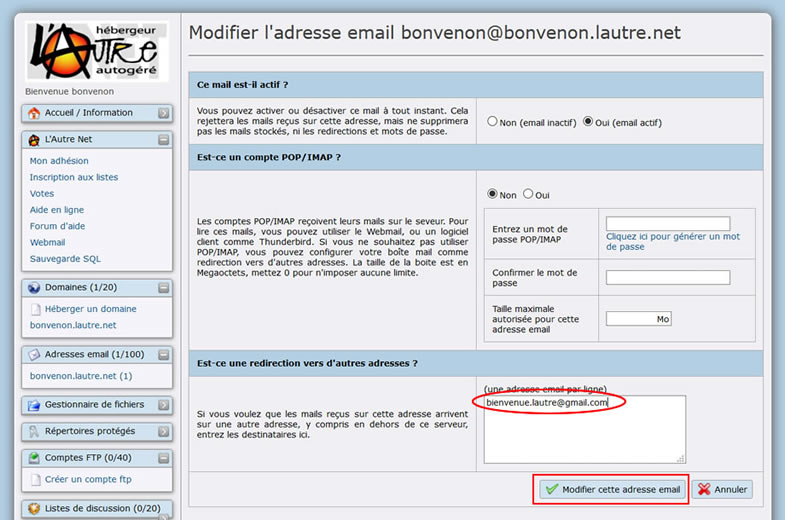  
>>
(illustration 25)  
 
>

## Une première page. 

Nous avons vu que le répertoire par défaut de notre site web www\.*bonvenon*.lautre.net est vide. Comment commencer à construire un site ? 

Nous allons commencer, juste pour la démonstration, par une manipulation très simple : nous allons placer un fichier dans notre répertoire /bonvenon/www/bonvenon.lautre.net/ .

Comme nous le savons, les navigateurs, quand ils arrivent quelque part sans autre indication qu'un répertoire, cherchent dans ce répertoire un fichier qui se nommerait index.html, et s'ils le trouvent ils l'ouvrent. Nous allons donc placer un fichier avec ce nom dans notre répertoire.

Accéder au Gestionnaire de fichiers (illustration 11)
saisir "index.html" dans le champ (ovale rouge) puis cliquer sur le bouton "créer" (rectangle rouge)  
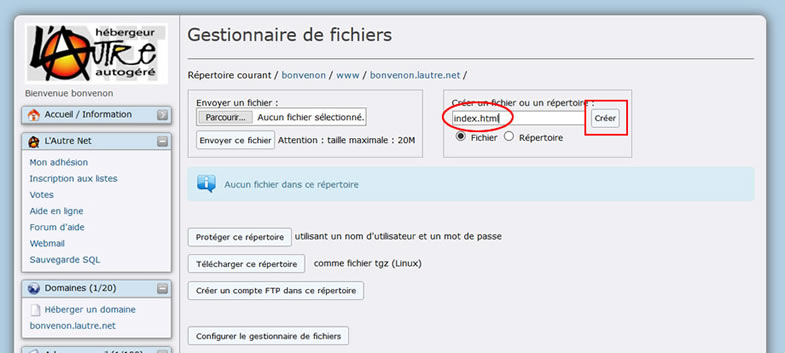  

(illustration 26)  
 

Le fichier "index.html" est maintenant présent dans le répertoire mais il est vide.
Cliquer sur le lien "index.html" (ovale rouge)
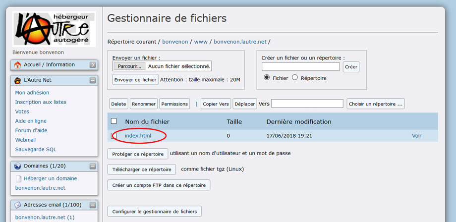  

(illustration 27)  
  

Cliquer sur l'onglet "Modifier "(ovale rouge)  

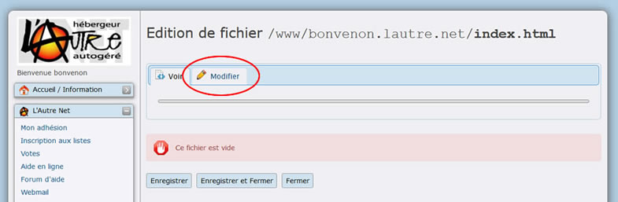  

(illustration 28)  
 

Recopier (copier/coller) le texte ci-dessous dans la zone de texte (ovale rouge)
 
    <html><body><h1>&Ccedil;a marche!</h1> 
    
Ceci est la page web par d&eacutefaut de ce site.
 
    
Le site fonctionne mais aucun contenu n'a &eacutet&eacute ajout&eacute, encore.
 
    </body></html>
    
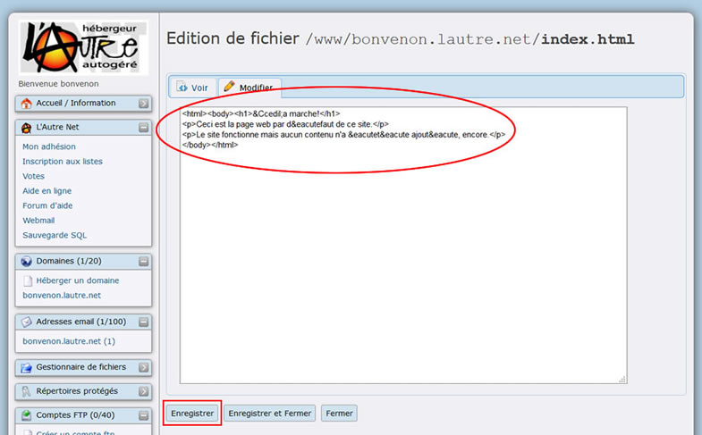  

(illustration 29)  
   

puis cliquer sur le bouton "Enregistrer" (rectangle rouge)

Revenons à la page du navigateur qui nous affichait ""Index of /" , c'est à dire celle de notre site par défaut (http://www\.*bonvenon*.lautre.net) et rechargeons-la (touche Ctrl + F5, pour la pluspart des navigateurs) :  

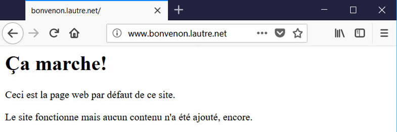  

(illustration 30)  
 

Voilà, notre page s'affiche.

Une autre manière de créer le fichier index.html consiste à le transférer depuis l'ordinateur local.  

Commençons par créer le fichier index.html sur notre ordinateur local, sur le bureau par exemple.

Accédons à la partie "Gestionnaire de Fichiers" de l'interface (illustration 11). Cliquer sur les différents répertoires jusqu'à arriver au répertoire bonvenon.lautre.net/ 

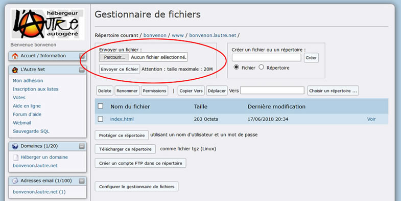  

(illustration 31)  
  

nous voyons qu'il y a une zone qui nous permet d'importer un fichier : en cliquant sur le bouton Parcourir..., une fenêtre s'ouvre et nous pouvons chercher le fichier dans notre disque dur :  

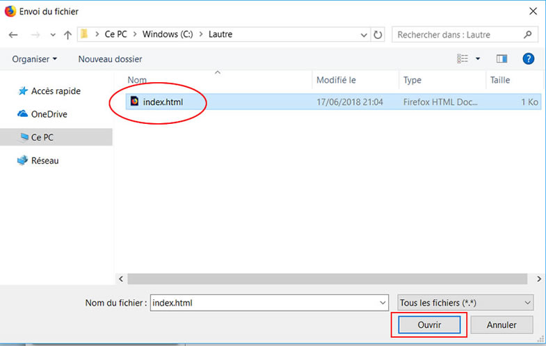

(illustration 32)  
 

Sélectionner le fichier (ovale rouge) puis cliquer sur le bouton "Ouvrir" (rectangle rouge)  
Il ne reste plus qu'à cliquer sur le bouton "Envoyer ce fichier" (rectangle rouge)   

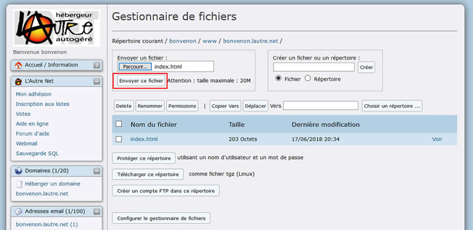

(illustration 33)  
 

## Récapitulons un peu.

Nous venons d'ouvrir un compte, *bonvenon*.  
**Nous rappelons que tout au long de ce document « *bonvenon* » est équivalent à « login » ou « nom\_de\_votre\_compte ».**  
Nous avons déjà :

- un nom de domaine : *bonvenon*.lautre.net
- un sous-domaine associé : www\.*bonvenon*.lautre.net
- un emplacement tout prêt pour mettre nos pages web : /bonvenon/www/bonvenon.lautre.net/ 
- un compte ftp (file transfert protocole) pour échanger des fichiers entre notre espace d'hébergement et notre ordinateur, et associé à « la racine » de notre espace.(Ce répertoire est symbolisé par /);
- une adresse mail associé à notre domaine : *bonvenon*@*bonvenon*.lautre.net ;

Aucun utilisateur MySQL, ni aucune base de données, n'est défini au départ (c'est marqué en rouge dans l'écran d'accueil) :

En effet cela n'est pas indispensable : on peut très bien faire un site web sans base de données, et dans ce cas il n'est pas utile de consommer de la ressource qui sera inutilisée.

Maintenant, si nous voulons utiliser notre domaine pour faire notre site et installer un [Content Management System (CMS), Système de Gestion de Contenu (SGC) en Français](https://fr.wikipedia.org/wiki/Syst%C3%A8me_de_gestion_de_contenu) comme [SPIP](http://www.spip.net/),le principe reste le même. Il suffit de placer les fichiers qui constituent ces systèmes de publication là où nous avons mis pour l'instant un seul fichier : dans  notre espace /bonvenon/www/bonvenon.lautre.net/.

Mais pour cela il y a [le reste de la documentation](http://aide.lautre.net/), des listes d'aide, et surtout des membres: vous, moi, tous. **L’Autre Net est une association** qui héberge nos sites web depuis 2001, mais aussi nos emails, ou tout autre service web utile à ses membres.

**Tous les acteurs de lautre.net (trésorerie, technique, courrier...) sont bénévoles.**

Bienvenue parmi NOUS.
