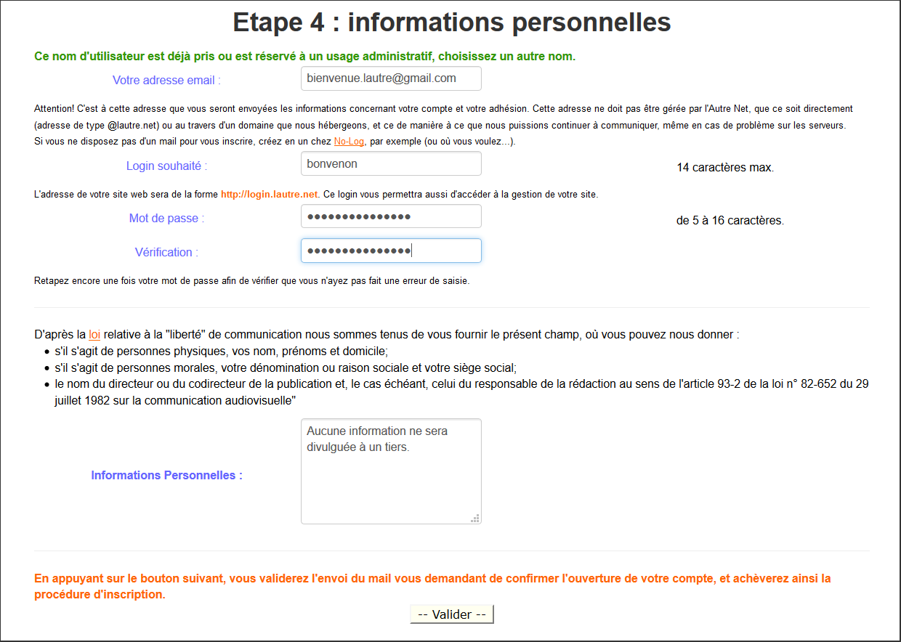
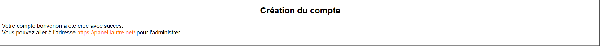
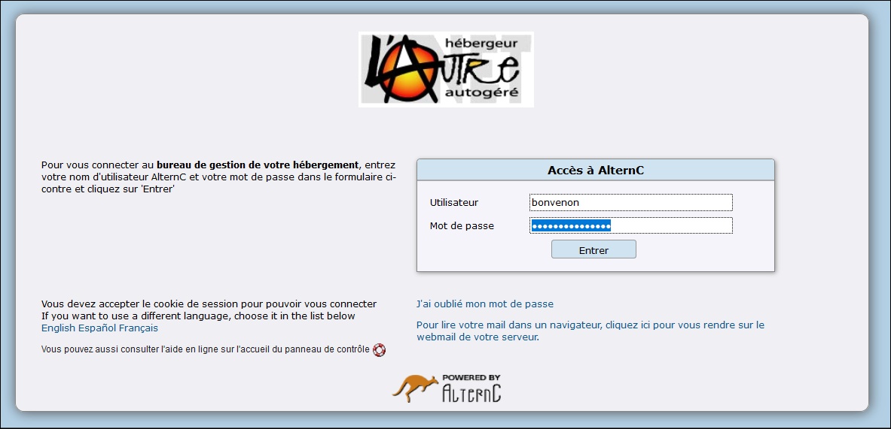
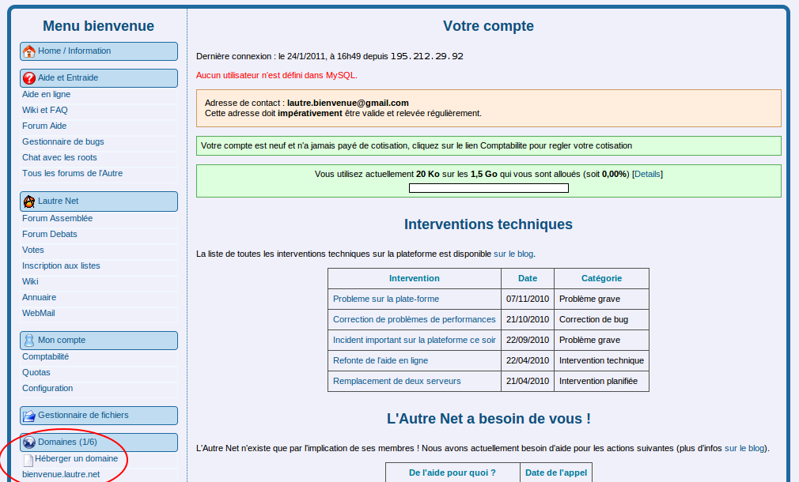
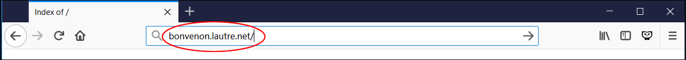
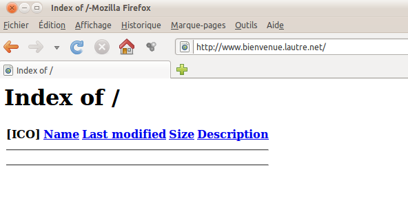

Title: Bienvenue à l'Autre Net 
Date: 2011-06-03 09:02:11
Category: 01. Bienvenue 
Tags: old
Summary: Vous êtes en train de créer un compte et vous souhaitez publier sur internet. Les pages qui suivent pourraient vous aider

Vous venez de créer un compte et vous souhaitez publier sur internet. Les pages qui suivent ont pour but

- de vous faire faire un premier « tour de la maison » et
- traiter d'un cas très simple : publier une première page sur internet.

L'objectif est de vous montrer le B.A  BA, en supposant que vous n'y connaissez pas grand chose.  
*(Donc, les geeks, passez votre chemin, sauf si vous avez des suggestions « constructives » ;-) )*.

Pour les exemples présentés dans cette aide, nous avons créé un compte ayant pour nom **bonvenon**. C'est le "nom\_du\_compte" ou le "login" ou le "nomdevotrecompte" *(Dans les pages de cette documentation vous rencontrerez selon le cas un de ces trois termes utilisés. Dans ce texte,* **bonvenon** *est à remplacer par le "nom de votre compte".)*, que nous avons choisi lors de notre inscription lors de l'étape 4.  

 
<center>(illustration 1)  </center>      
Après l'étape 4 vous avez reçu un mail vous invitant à confirmer la création de votre compte sur lautre.net. En cliquant sur le lien contenu dans ce mail votre navigateur ouvre un nouvel onglet confirmant le création du compte.  
  

<center>(illustration 2)  </center>   

Votre compte est maintenant validé vous pouvez vous connecter sur l'interface de gestion.   

Le login n'est pas modifiable par la suite. C'est ce login (ou nom\_du\_compte) qui nous permet de [nous connecter au bureau de gestion de notre hébergement](https://panel.lautre.net/)  


<center>(illustration 3)  </center>  

## Un tour de la maison

Nous arrivons sur le panneau de gestion de notre compte.   


<center>(illustration 4)  </center>  

nous pouvons constater, dans la colonne de gauche que nous avons déjà :

- un domaine : *bonvenon*.lautre.net ;
- une adresse mail associé à notre domaine ;

Nous avons aussi, mais cela ne se voit pas dès l'arrivée dans l'interface :

- un emplacement prêt à recevoir les fichiers de notre site : www\.*bonvenon*.lautre.net ;

Nous avons déjà un **« domaine »** *(par commodité de langage on parle de domaine et sous-domaine en prenant comme référence le point de départ dans l'arborescence. Si nous considérons* **lautre.net** *comme un domaine, alors*  **bonvenon.lautre.net** *est un sous-domaine, mais si nous considérons que* **bonvenon.lautre.net** *est le domaine alors*  **www\.bonvenon.lautre.net** *est un sous-domaine.)*.  


En créant notre compte, et tel qu'il est dit dans la [page d'accueil de notre association](https://lautre.net/) «chaque membre de l’Autre Net dispose d'un  sous-domaine en lautre.net (nomdevotrecompte.lautre.net)». C'est le Login souhaité que nous avons indiqué (voir illustration 1). Nous avons maintenant un sous-domaine : *bonvenon*.lautre.net, comme on le voit dans la zone entourée.   


<center>(illustration 5)  </center>   

Saisissons ce nom de domaine dans la barre d'adresse de notre navigateur.   
    

<center>(illustration 6)  </center>   

Après validation nous obtenons :    


<center>(illustration 7)  </center>   

Nous avons maintenant un **www\.** qui est apparu dans l'adresse.La page nous affiche **"Index of /"**

Pour comprendre revenons à l'interface, et regardons de plus près notre domaine, en cliquant sur son nom (*bonvenon*.lautre.net). (voir illustration 8).  

<center>(illustration 8)  </center>   

Dans la partie droite de l'interface il y a une liste à deux parties : sur la gauche (entourée carré) les sous-domaines de notre tout nouveau domaine *bonvenon*.lautre.net, ce dernier compris, et à droite (entourée ovale) où ils se trouvent. Regardons le domaine *bonvenon*.lautre.net en cliquant sur le bouton "Modifier" à gauche de son nom (voir illustration 9). 


Ce sous-domaine est redirigée vers une autre adresse (un autre sous-domaine) qui est http://www.*bienvenue*.lautre.net. Voilà pourquoi quand nous avons tapé http://*bienvenue*.lautre.net.nous avons vu apparaître http://www.*bienvenue*.lautre.net.

Qu'il y a-t-il derrière http://www.*bienvenue*.lautre.net ? Si nous revenons en arrière, puis cliquons cette fois-ci sur le crayon à coté de www.*bienvenue*.lautre.net, nous avons :


Il est indiqué que ce sous-domaine est « géré en local », autrement dit que les fichiers sont dans le serveur de l'Autre Net, et il nous dit où sont ces fichiers : dans le répertoire /www/*bienvenue*.lautre.net.[[Nota bene : nous nous demandons pourquoi ce salamalec d'aller de *bienvenue*.lautre.net à www.*bienvenue*.lautre.net. C'est que nous avons des roots (ce sont les nounous qui font que nos serveurs tournent) très organisés. Pour comprendre, voici un extrait de wikipedia :

«Dans le système de noms de domaine, un nom de domaine (NDD en notation abrégée française ou DN pour Domain Name en anglais) est un identifiant de domaine internet. 

Un nom de domaine est un « masque » sur une adresse IP. Le but d'un nom de domaine est de retenir facilement l'adresse d'un site. Par exemple, wikipedia.org est plus simple à mémoriser que 91.198.174.2. 

Le système de nom de domaine est hiérarchique, permettant la définition de sous-domaines. 

Le nom de domaine est composé d'au moins deux mots, les labels. S'il y a plusieurs labels (et il y a au moins deux), on doit les séparer par un point. 

Dans un nom de domaine, le label d'extrême droite doit être choisi dans la liste des noms de domaine de premier niveau, appelé aussi domaine de tête (en anglais Top Level Domain ou TLD). 
Il existe deux types de domaines de premier niveau : 
   1. les domaines nationaux de premier niveau (en anglais Country Code Top-Level Domain ou ccTLD) composés de deux lettres identifiant un pays ou un territoire indépendant (exemple : fr pour France) ; 
   2. les domaines de premier niveau génériques (en anglais generic Top-Level Domain ou gTLD) composés de trois lettres ou plus identifiant généralement le secteur d'activité dans lequel opèrent les individus ou les organisations qui les utilisent : org, net, com.

Le nom d'un domaine de deuxième niveau doit inclure un minimum de 3 et un maximum de 63 caractères. 

Le terme domaine désigne habituellement un domaine de deuxième niveau. Voici quelques noms de domaine valides : wikipedia.org, paris.fr,  louvre.museum, yaourt.biz et lautre.net. 

Il est possible de définir des sous-domaines dans un domaine. **L'un des sous-domaines les plus répandus est « www »**, mais il est possible d'utiliser n'importe quelle suite de caractères satisfaisant les conditions générales de rédaction des noms de domaine. Par exemple, tour-eiffel.paris.fr est un sous-domaine de paris.fr, et *bienvenue*.lautre.net est un sous-domaine de lautre.net. 

Le Domain Name System (ou DNS, système de noms de domaine) est un service permettant d'établir une correspondance entre une adresse IP et un nom de domaine et, plus généralement, de trouver une information à partir d'un nom de domaine. 

(sources: https://fr.wikipedia.org/wiki/Nom_de_domaine et https://fr.wikipedia.org/wiki/Serveurs_DNS, à peine modifiées) »

Donc nos roots préparent déjà le domaine « normal » du web : www.]]

Nous avons déjà un nom de domaine, mais en plus...

**Nous avons déjà un emplacement prêt à recevoir les fichiers de notre site.**

Dans la colonne Menu, à gauche, nous avons le choix Gestionnaire de fichiers :


Si on clique dessus :


nous voyons que dans notre espace de travail *bienvenue* (entourée en haut, qui est la « racine » de notre site, et que l'on symbolise par /) se trouvent déjà trois répertoires[[Un répertoire c'est un dossier. Dans le Gestionnaire des fichiers du bureau AlternC les répertoires sont indiqués par un nom suivi d'un /]] (entourés en bas) : backups/, stats/ et www/. Cliquons dans le répertoire www/ (c'est-à-dire sur son nom) :


Ce répertoire contient un autre répertoire : *bienvenue*.lautre.net. Cliquons sur son nom :


Ce répertoire est vide.

Donc, lorsque nous avons tapé dans la barre adresses du navigateur *bienvenue*.lautre.net nous avons été redirigés vers http://www.*bienvenue*.lautre.net, et là on nous a dit d'aller chercher les fichiers « en local » dans le répertoire /www/*bienvenue*.lautre.net.

Il n'y a rien dedans. C'est pour cela que notre navigateur affiche l'index of / et rien d'autre. Le navigateur suit le cheminement que nous avons fait, puis affiche ce qu'il y a : rien, liste vide.

**Nous avons déjà un compte ftp.**

Pour échanger des fichiers entre notre espace d'hébergement et notre ordinateur nous pouvons :
- le faire directement, mais uniquement dans le sens notre ordinateur vers notre espace d'hébergement, avec AlternC tel que [c'est expliqué dans la documentation](http://aide.lautre.net/Import-de-fichiers-et-FTP) et plus loin dans ce document ;
- utiliser le [protocole de transfert de fichiers ftp](https://fr.wikipedia.org/wiki/File_Transfer_Protocol) et un logiciel spécialisé telle que [FileZilla](http://www.filezilla.fr/) [[Il y a beaucoup de logiciels pour cela. Nous utilisons FileZilla.]]. Pour cela il faut qu'il y ait un « compte ftp » permettant la connexion à notre espace par ce protocole. **Ce compte ftp est déjà prêt**. Si nous cliquons sur le choix « liste des comptes ftp » dans le Menu :


nous obtenons :


Nous voyons qu'il existe un compte ayant pour utilisateur *bienvenue* et qui « pointe » sur la racine de notre espace d'hébergement, c'est à dire /. Ce compte par défaut a le même mot de passe que notre compte (celui que nous utilisons pour nous connecter au bureau).

**Nous avons déjà un compte mail.**

Lors de la création du compte à l'Autre Net un compte mail par défaut est crée, attaché à notre domaine , c'est à dire de la forme @*bienvenue*.lautre.net:


En cliquant sur ce compte (c'est à dire sur son nom) :


nous voyons que ce compte mail par défaut est *bienvenue*@*bienvenue*.lautre.net (login@login.lautre.net), et si nous regardons ses caractéristiques en cliquant sur le crayon à côté :


nous constatons qu'il y a déjà une redirection des mails vers l'adresse que nous avons fournie en remplissant le formulaire d'adhésion. Donc, par défaut, les mails qui sont envoyés à *bienvenue*@*bienvenue*.lautre.net vont arriver à notre adresse de contact, qui est aussi celle que nous utilisons pour participer à notre assemblée générale permanente.

Mais comment lire directement les messages adressés à *bienvenue*@*bienvenue*.lautre.net ? Comme il est indiqué dans cette page, « vous pouvez consulter votre boîte au lettres par webmail » 
- en allant sur l'adresse http://*bienvenue*.lautre.net/webmail/
- avec pour identifiant *bienvenue*@*bienvenue*.lautre.net
- et pour mot de passe celui de votre compte.
**Mais il faut au préalable avoir coché la casse Compte POP**, comme c'est écrit « Si vous voulez stocker les emails recus et y accéder avec un logiciel de messagerie ou le webmail, cochez la case 'Compte pop'. ». **Sinon ça marchera pas**. Nous pouvons aussi par la même occasion changer le mot de passe, mais c'est optionnel.


## Une première page.

Nous avons vu que le répertoire par défaut de notre site web www.*bienvenue*.lautre.net est vide. Comment faire un site ? 

Nous allons commencer, juste pour la démonstration, par une manipulation très simple : nous allons y placer un fichier dans notre répertoire /www/*bienvenue*.lautre.net.

Comme nous le savons, les navigateurs, quand ils arrivent quelque part sans autre indication qu'un répertoire, cherchent dans ce répertoire un fichier qui se nommerait index.html, et s'ils le trouvent ils l'ouvrent. Nous allons donc placer un fichier avec ce nom dans notre répertoire. Dans ce fichier y a cela :

````
<html><body><h1>ça marche!</h1> 
<p>Ceci est la page web par défaut de ce site.</p> 
<p>Le site fonctionne mais aucun contenu n'a été ajouté, encore.</p> 
</body></html>
````

C'est « une page html » on ne peut plus basique. Ce fichier est sur le bureau de notre pc. Si nous regardons l'illustration « Gestionnaire de fichiers, répertoire /www/bienvenue.lautre.net » :


nous voyons qu'il y a une zone qui nous permet d'importer un fichier : en cliquant sur le bouton Parcourir..., une fenêtre s'ouvre et nous pouvons chercher le fichier dans notre disque dur :


une fois le fichier sélectionné (double cliq ou cliq + Ouvrir) nous cliquons sur Envoyer :


et voilà le résultat :


Revenons à la page du navigateur qui nous affichait Index of / , c'est à dire celle de notre site par défaut (http://www.*bienvenue*.lautre.net) et rechargeons-la :


Voilà, notre page s'affiche.

Récapitulons un peu.

Nous venons d'ouvrir un compte, *bienvenue*[[Nous rappelons que tout au long de ce document « *bienvenue* » est équivalent à « login » ou « nom_de_votre_compte »]], alors nous avons déjà :

- un nom de domaine : *bienvenue*.lautre.net
- un sous-domaine associé : www.*bienvenue*.lautre.net
- un emplacement tout prêt pour mettre nos pages web : /www/*bienvenue*.lautre.net
- un compte ftp (file transfert protocole) pour échanger des fichiers entre notre espace d'hébergement et notre ordinateur, et associé à « la racine » de notre espace[[Ce répertoire est symbolisé par /]] ;
- une adresse mail associé à notre domaine : *bienvenue*@*bienvenue*.lautre.net ;

Pourquoi aucun utilisateur MySQL, ni aucune base de données, est défini au départ (c'est marqué en rouge dans l'écran d'accueil) :


Parce que cela n'est pas indispensable : on peut très bien faire un site web sans base de données, et dans ce cas pas la peine de sortir un canon pour tuer une mouche.

Maintenant, si nous voulons :
- utiliser notre domaine par défaut pour faire notre site et
- installer un [CMS](https://fr.wikipedia.org/wiki/Syst%C3%A8me_de_gestion_de_contenu) comme [SPIP](http://www.spip.net/),

le principe reste le même : il suffit de placer les fichiers qui constituent ces systèmes de publication là où nous avons mis pour l'instant un seul fichier : dans  notre espace /www/bienvenue.lautre.net.

Mais pour cela il y a [le reste de la documentation](http://aide.lautre.net/), des listes d'aide, et surtout des membres: vous, moi, tous. **L’Autre Net est une association** qui héberge NOS sites web depuis 2001, mais aussi nos emails, ou tout autre service web utile à ses membres.

**Tous les acteurs de lautre.net (trésorerie, technique, courrier...) sont bénévoles.**

Bienvenue parmi NOUS.
