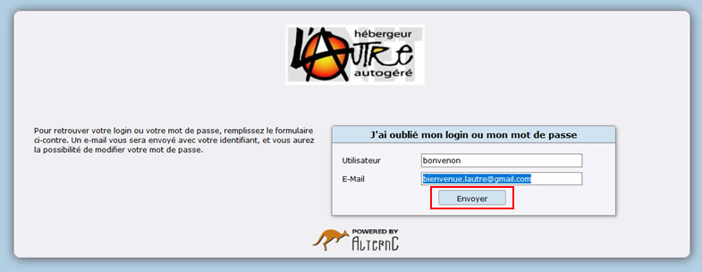
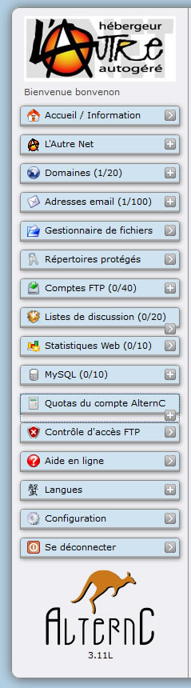

Title: 01. Connexion 
Date: 2009-03-03 03:06:39
Category: 02. Interface
Tags: old
Summary: Première étape : la connexion au bureau virtuel  . 

## Connexion
L'administration de compte hébergés sur le serveur, comme la gestion d'un compte, nécessite une authentification.

Dans le navigateur indiquer l'adresse :
https://panel.lautre.net/  

Attention : 

- Ne pas oublier le « s » après http ... il signifie que la connexion sera sécurisée, les informations échangées entre le serveur et votre ordinateur circuleront chiffrées, et non en clair sur le réseau Internet, interdisant les interceptions malveillantes.

- Vérifier que le navigateur utilisé accepte les cookies pour ce site.

L'utilisateur et le mot de passe sont ceux que vous avez choisis lors de l'inscription (Etape 4).

Si vous avez oublié votre mot de passe utiliser le lien "[J'ai oublié mon mot de passe](https://listes.lautre.net/sendpass.php)"

Il vous sera demandé votre "Utilisateur" ainsi que votre adresse E-Mail.

Vous recevrez un email contenant un lien vous permettant de choisir un nouveau mot de passe (ovale rouge).

N'oubliez pas de cliquer sur le bouton "Changer mon mot de passe" (rectangle rouge).

Si vous avez oublié l'email utilisé lors de votre inscription signalez votre difficulté aux administrateurs par email à l'adresse "root@lautre.net"  

Les fenêtres de gestion d'un compte et d'administration des comptes sont toutes  construites de la manière suivante : à gauche le menu, à droite un espace dans lequel s'afficheront les actions à accomplir ou accomplies.
Ces fenêtres constituent le « bureau virtuel » que nous allons découvrir ci après.

## Menu

Voici la copie d'écran de la partie menu de l'interface de gestion.

  

Chaque zone bleu est un lien qui affichera soit une liste de choix si elle se termine par un "+" soit dans la partie droite du bureau (coupée ici), les informations concernant les actions à accomplir ou accomplies.

Nous les découvrirons dans les chapitres suivants.

Les nombres entre parenthèses « Domaines (1/20) » par exemple indiquent qu'un nom de domaine existe pour ce compte et que le nombre maximum de domaines est de 20.

