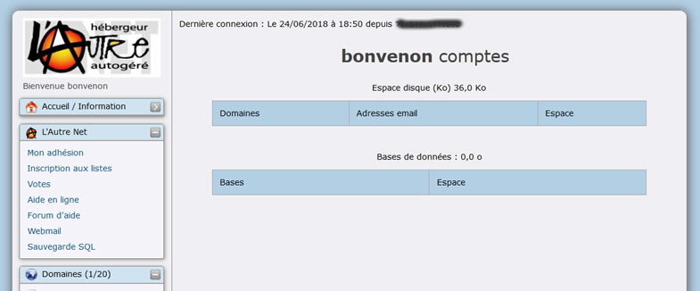
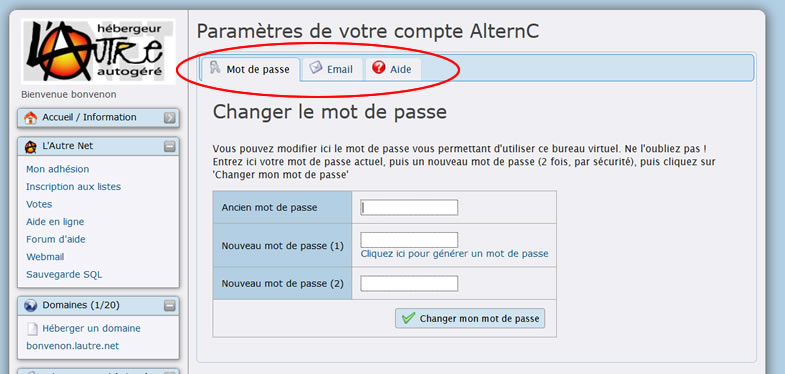
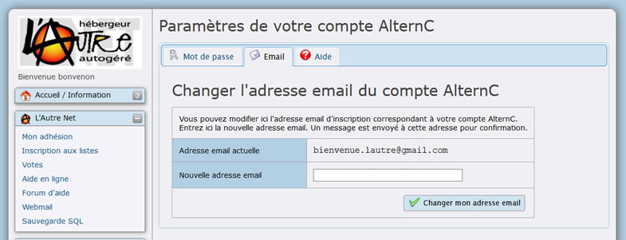
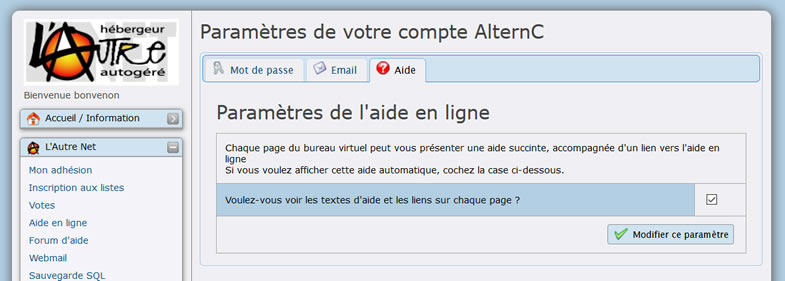

Title: 02. Prise en mains 
Date: 2009-03-03 16:46:43
Category: 02. Interface
Tags: old
Summary: Ce que vous pouvez faire depuis le bureau virtuel d'AlternC. . 

## Actions

Après authentification, le gestionnaire d'un compte AlternC accède au bureau virtuel du compte.

Depuis le bureau virtuel de son compte l'utilisateur peut :

  -  Installer un nom de domaine et gérer des sous-domaines
  -  Créer et gérer des boites aux lettres électroniques et des alias
  -  Créer et gérer des accès FTP (pour le transfert de fichiers sur le compte)
  -  Créer et gérer des listes de discussion/diffusion
  -  Télécharger, modifier, déplacer ... les fichiers de son site web
  -  Installer, consulter les statistiques de fréquentation de son site web
  -  Créer et gérer des accès privés à certaines pages de son site web
  -  Créer et gérer des bases de données liées à son site web

Vous pouvez également effectuer des opérations de consultation et de configuration des caractéristiques de votre compte et accéder à une aide en ligne.

## Utilisation

AlternC offre un panel de possibilités au titulaire et gestionnaire d'un compte.

  -  Héberger un nom de domaine qui pointe vers un compte hébergé sur ce serveur ou sur un autre serveur ...
  -  Héberger un ou plusieurs sites web, statiques ou dynamiques.
  -  Utiliser uniquement les fonctionnalités, particulièrement riches, du courrier électronique : accès sécurisé (SSL), création de son propre SMTP lié à un nom de domaine (si son fournisseur d'accès internet le permet), accès par webmail sécurisé (https), configuration de filtres depuis le webmail.
  -  Communiquer par listes de diffusion / discussion.
  
... ou tout cela à la fois.

L'ensemble des quotas (espace disque, nombre de mails, de domaines, de comptes FTP, de bases de données) est visible pour le gestionnaire d'un compte depuis le lien « Quotas du compte AlternC / Espace disque (Ko) » dans le menu du bureau virtuel.

## Bureau virtuel

Le bureau se compose de deux espaces :

  -  Le menu, à gauche, sous le nom du compte.
  -  La partie droite, qui spécifie, après connexion au bureau, diverses informations concernant votre compte.

Ces informations indiquent :

  -  La date est l'heure de votre dernière connexion ainsi que l'existence d'éventuelles connexions refusées
  -  Les domaines gérés
  -  L'espace disque occupé
  -  les adresses mail crées
  -  Les bases de données exploitées et les tailles qu'elles occupent

Ainsi le gestionnaire d'un compte est informé d'éventuelles tentatives d'intrusion sur son compte.  
Si ce cas se présente sans qu'il y ait eu de fausse manoeuvre (erreur de frappe dans le nom du compte ou le mot de passe) il est conseillé de contacter l'administrateur du serveur qui consultera les logs (Voir ci-dessous l'exemple).

## Configuration

La création d'un compte AlternC requiert un mot de passe et une adresse mail du gestionnaire du compte. Vous pouvez les modifier depuis le lien [Configuration](https://listes.lautre.net/mem_param.php) du bureau virtuel.

Utilisez l'onglet "Mot de passe" (ovale rouge) pour **changer votre mot de passe** .  
Attention, votre mot de passe initial est requis. Si vous l'avez égaré, utilisez le lien "[J'ai oublié mon mot de passe](https://listes.lautre.net/sendpass.php)" de l'écran de connexion pour le modifier.

Utilisez l'onglet "Email" (ovale rouge) pour **changer l'adresse mail du gestionnaire du compte** .  
Une confirmation sera adressé par mail à l'ancienne adresse. Nous vous recommandons d'utiliser une adresse mail qui ne soit pas sur le serveur qui héberge votre compte, ceci afin de pouvoir communiquer avec vous en cas d'éventuel dysfonctionnement du serveur.

Utilisez l'onglet "Aide" (ovale rouge) pour **Activer l'affichage de l'aide** dans les pages de l'interface. 

