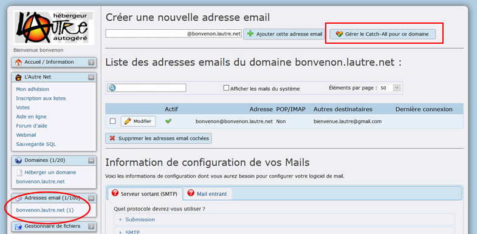

Title: 03. FAQ Migration Juillet 2016 
Date: 2018-05-01 20:01:24
Category: 02. Interface
Tags: old
Summary:  . Si votre CMS n'est pas à jour, mettez-le à jour


## 1. Les caractères accentués s'affichent mal


- Cause: [Configuration de PHP5.6](http://php.net/manual/fr/ini.core.php#ini.default-charset)
- Solution : Définir manuellement le **charset** dans le code PHP [1]

````
ini_set("default_charset", "iso-8859-1");
````


## 2. Erreurs E_DEPRECATED qui s'affichent sur mon site

- Cause: configuration erronée du error\_reporting par votre CMS qui
affiche les erreurs E_DEPRECATED (désactivé par défaut dans la config
générale)
- Solution : ajouter la ligne suivante dans votre code PHP ou remplacer
celle qui existe [1]

````
error_reporting(E_ALL & ^E_DEPRECATED & ^E_WARNING);
````

et éventuellement désactiver l'affichage des erreurs

````
ini_set("display_errors", 0);
````

Note: vous pouvez faire ces modifications dans le .htaccess uniquement si vous utilisez une version supérieure ou égale à PHP 5.3


## 3. URL ne fonctionnent plus sans extension

- Cause: Avant on pouvait appeler http://example\.com/example pour charger
le fichier example.php. Cela était dû au paramétrage de l'option
**MultiViews** désactivée dans AlternC pour raison de sécurité
- Solution : remplacer par un fichier **.htaccess** [1]

Exemple pour des fichiers en .php:

````
RewriteEngine On
RewriteCond %{REQUEST_FILENAME} !-d
RewriteCond %{REQUEST_FILENAME} !-f
RewriteCond %{REQUEST_FILENAME}.php -f
RewriteRule ^(.*)$ $1.php [QSA,L]
````

On peut répéter les 4 dernières lignes pour les adapter pour supporter
d'autres extensions comme .html et .htm


## 4. Site qui ne fonctionne pas en PHP 5.6

- Cause: Le site n'a pas encore été mis à jour (malgré la longue période
laissée avant la migration)
- Solution : repasser **temporairement** en PHP 5.3 pour pouvoir faire la
mise à jour de votre site [1]

Se connecter au panel, cliquer sur le nom de domaine, puis sur le bouton
"Modifier" à gauche du sous-domaine concerné, sélectionner la case PHP 5.3 (ovale rouge) puis renseigner le répertoire (qui reste normalement le même que celui qui avait été choisi à droite de l'option "Hébergé localement" rectangle rouge).


Effectuer la mise à jour de votre site.

Ensuite repassez en PHP 5.6 en sélectionnant le bouton "Redirection vers l'URL" pour vérifier que tout fonctionne

Continuez à faire les mises à jour aussi longtemps que vous utiliserez le
même logiciel


## 5. Liste de discussions non administrables

En attendant de résoudre le bug:

Modifier le lien d'administration pour le faire commencer par
[https://listes.lautre.net/](https://listes.lautre.net/) (c'est normalement bon depuis le bureau)

Si ça ne marche pas (listes neuves par exemple), essayer avec
[https://panel.lautre.net/](https://panel.lautre.net/)


## 6. Problème connexion IMAP

Utiliser les paramètres affichés dans le bureau
Le nom d'utilisateur est l'adresse e-mail et ne possède pas de underscore
"_" (souligné, "tiret du 8").

En cas de problème avec Thunderbird, une procédure de vérification des
fichiers existe.


## 7. Serveur FTP

Utiliser l'adresse "ftp.lautre.net" comme précisé dans l'[aide](http://aide.lautre.net/04-import-de-fichiers-et-ftp.html)


## 8. Adresses catch-all

Pour paramétrer le catch-all cliquer sur le lien correspondant à l'adresse émail de votre compte (ovale rouge) puis cliquer sur le bouton "Gérer le catch-all pour ce domaine"




## 9. Roundcube 

Roundcube permet directement d'administrer le filtrage des mails et leur mot de passe.

Ceux qui veulent récupérer leur carnet d'adresse squirrelmail peuvent s'adresser aux roots


## 10. Machines virtuelles

Nous sommes en attente du développement de la fonctionnalité:
https://github.com/AlternC/AlternC/issues/62


## 11. Restrictions mails

Afin d'endiguer l'envoi de spams par des sites piratés, certaines restrictions existent concernant le nombre d'envoi de mails depuis votre site web (et également en SASL).

Pour ceux souhaitant envoyer légitimement et massivement du mail depuis leurs sites, merci d'en discuter avec les roots.

L'envoi des mails depuis les sites web doit se faire uniquement en utilisant la fonction "mail" de PHP. Pas d'accès possible vers le port SMTP.


## 12. Prochainement / (actuellement en panne)

- Calcul des quotas


*[1] Si votre CMS n'est pas à jour, mettez-le à jour !*