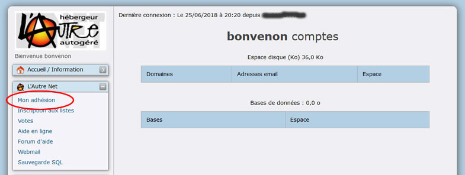
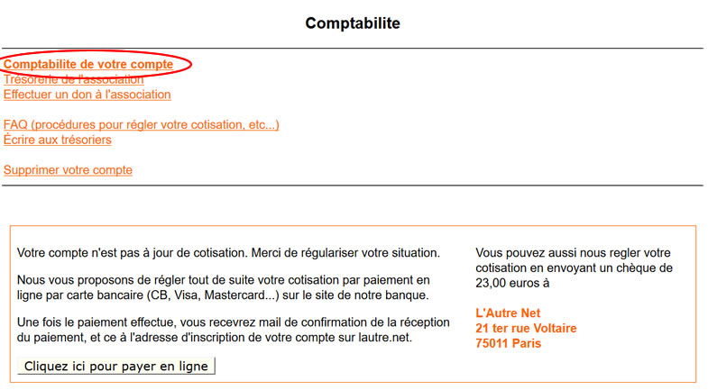
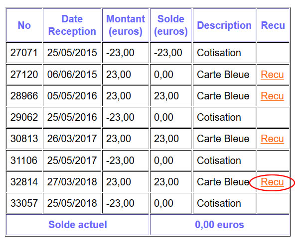
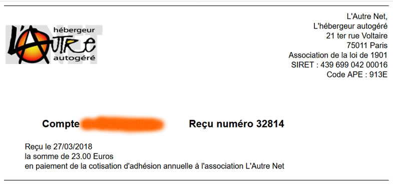

Title: 02. Obtenir une facture 
Date: 2018-06-04 17:40:20
Category: 03. Administration d'un compte
Tags: old
Summary:  . 

RAPPEL : Lautre.net n'est pas un prestataire de service mais une association.

L'adhésion à l'association donne droit à l'utilisation des services d'hébergement, services qui sont exclusivement réservés aux membres de Lautre.net.

En conséquence :

- Il ne s'agit pas ici d'une facture mais d'un reçu : celui de votre cotisation à Lautre.net.
- Ce reçu est parfaitement légal et vaut justificatif de paiement.
- Votre cotisation est exempte de TVA ... celle-ci n'apparaît donc pas sur le reçu !

**IMPORTANT : l'obtention du reçu nécessite l'accès au compte AlternC et donc le login et mot de passe d'accès à ce compte.**

## Pour obtenir le reçu

Depuis le menu du bureau virtuel cliquer sur le lien "Mon adhésion".

Cliquer sur "Comptabilité de votre compte"

Dans le tableau Comptabilité, cliquer sur le lien "Reçu" à côté du mode de paiement de la cotisation  

Et voila ! Il ne vous reste plus qu'à imprimer !

