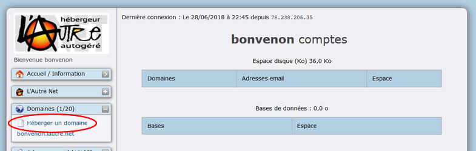
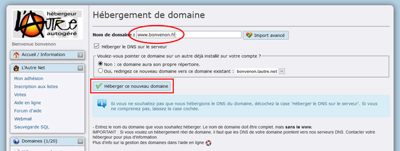
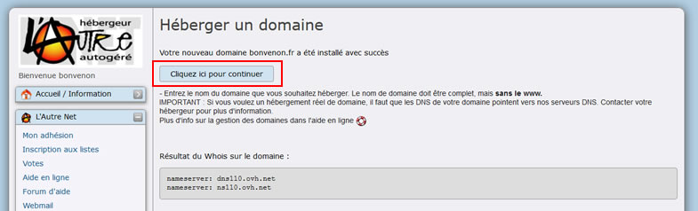
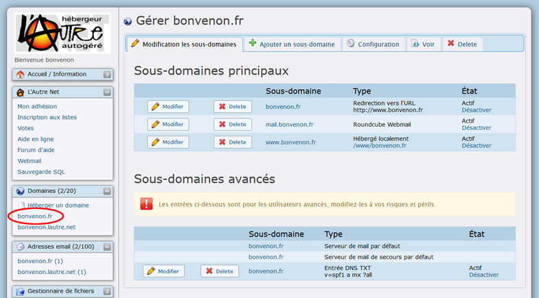
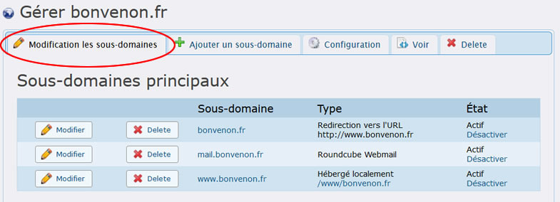
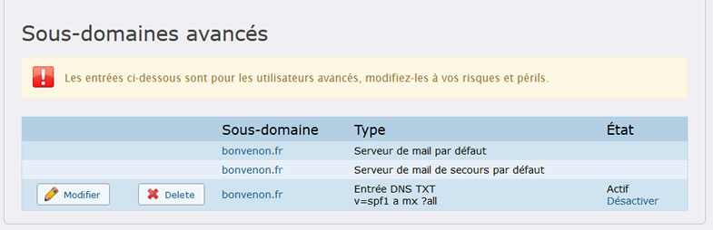
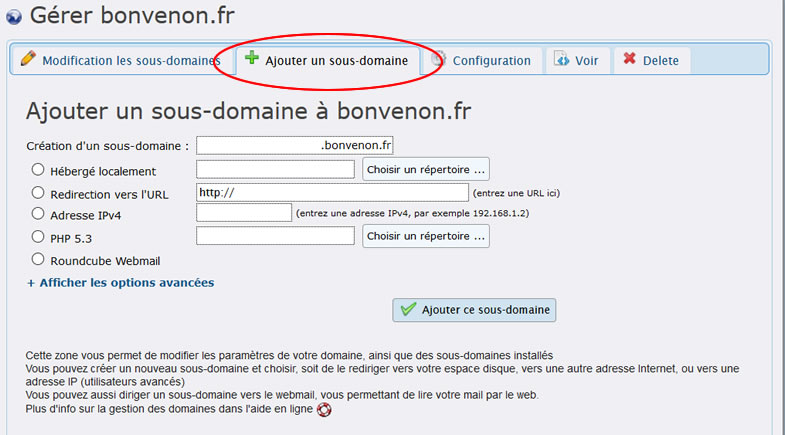
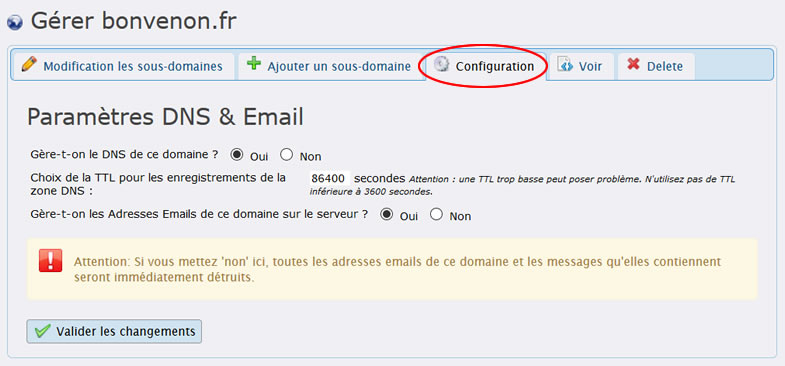
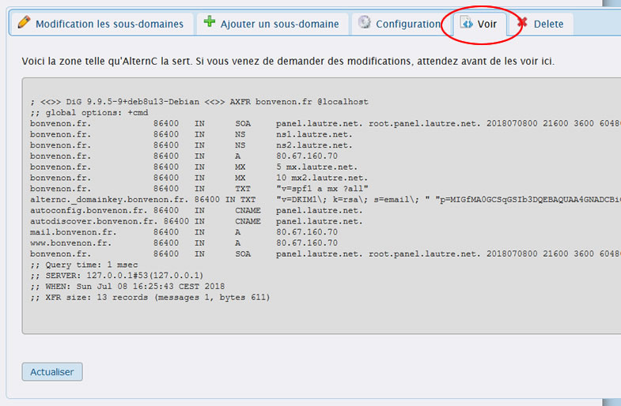

Title: 01. Nom de domaine 
Date: 2018-06-07 07:51:11
Category: 04. Gestion d'un compte
Tags: old
Summary: Gestion des noms de domaine et sous-domaines.

## Enregistrement du nom de domaine
Un nom de domaine se compose d'un nom suivi d'un point et d'une extension (fr, com, org, net ...). Chaque nom de domaine est unique au monde.  
Exemples : alternc.org, octopuce.fr, lautre.net.

Il s'enregistre, pour une durée déterminée, auprès d'un registrar (bureau d’enregistrement de noms de domaine).
Pour les domaines dont l'extension est net, org, com, fr ... enregistrer le domaine chez un registrar comme Gandi (http://gandi.net) ou BookMyName (http://bookmyname.com) par exemple.

**ATTENTION** Lorsque vous enregistrez un domaine deux cas de figure se présentent :

- Vous indiquez immédiatement les DNS (Domain Name Server) de L'Autre Net :

  -  ns1.lautre.net
  -  ns2.lautre.net

- Vous gardez les DNS de votre registrar (Gandi, Bookmyname...) et gérez manuellement, depuis le site du registrar, une redirection du nom de domaine vers lautre.net, dans ce cas  il faut indiquer l'adresse de notre serveur web, soit : 80.67.160.70.

Si vous avez un doute il vaut mieux nous poser la question !

Il faut enregistrer le nom de domaine avant de l'installer sur lautre.net, sauf pour les noms de domaine en .fr ou .eu, où il faut installer le domaine avant de l'enregistrer.  
Une vérification automatique est faite lorsqu'un domaine est installé. Si les DNS corrects ne sont pas enregistrées dans la base mondiale des noms de domaines, le serveur refusera l'installation.

Mais, pour que le monde entier puisse consulter les pages web vers lesquelles pointe le nom de domaine il faut attendre que les fournisseurs d'accès internet aient bien enregistré l'information afin de diriger leurs usagers vers le bon serveur (compter entre 24 et 72 heures).

## Installation d'un nom de domaine

Sur le bureau virtuel cliquer sur le lien "Héberger un domaine" (dans la fenêtre "Domaines")

  
Dans la partie droite du bureau virtuel, inscrire le nom de domaine que vous souhaitez héberger (ovale rouge).
puis cliquer sur bouton "Héberger un nouveau domaine" (rectangle rouge)

Vous obtenez la confirmation de l'hébergement

cliquer sur le bouton "Cliquer ici pour continuer".

Nous accedons à la page de gestion du domaine *bonvenon.fr*.  
Notre nouveau nom de domaine apparait dans la fenêtre "Domaines"

Nous pouvons gérer notre nouveau domaine.

Il faut toutefois attendre environ 5 minutes pour que le domaine soit bien pris en compte par le serveur, puis 1 heure pour qu'il soit pris en compte par les machines qui gère nos DNS (primary et secondary).

La procédure serait exactement la même pour un nom de domaine dont l'extension serait org, net, com, info ...

Comme signalé ci-dessus, certains noms de domaine doivent être installés sur le serveur **avant** leur enregistrement auprès du registrar. C'est le cas des noms de domaine en .fr car l'afnic (organisme qui gère ces noms) vérifie que le serveur est conforme à ce qui est demandé pour l'hébergement de ce type de nom de domaine.  
Ne pas hésiter à nous demander des informations à ce propos si nécessaire.

Nous allons maintenant étudier plus spécifiquement les paramètres de ce nom de domaine sur le serveur.

## Paramétrer le domaine installé sur le serveur

Le bureau virtuel affiche plusieurs onglets.  
Par défaut nous sommes sur l'onglet "Modification les sous-domaines" ( hé oui il y a aussi des coquilles dans AltenrC)  
Concernant la gestion des domaines et sous-domaines de leur liens avec les répertoires et les fichiers se reporter à l'article ["Bienvenue à l'Autre Net"](http://aide.lautre.net/bienvenue-a-lautre-net.html).

Dans ce premier temps, nous nous limiterons à décrire ces onglets.

**Sous-domaines principaux**  

Cet onglet permet de modifier ou supprimer un sous-domaine.  

Actuellement il indique que  le domaine : *bonvenon.fr* est redirigé vers  *www\.bonvenon.fr*, lui même géré en local (sur ce compte) et pointant à la racine du compte « / », cette barre oblique représente la racine.  
Nous y reviendrons dans la sous-rubrique ["Répertoires et fichiers"](http://aide.lautre.net/02-repertoires-et-fichiers.html).

**Sous-domaines avancés**

A n'utiliser que si vous maîtrisez parfaitement la définition des zones DNS.

  

ATTENTION : NE JAMAIS MODIFIER CES PARAMÈTRES SANS L'AVIS DE L'ADMINISTRATEUR DU SERVEUR.

**Ajouter un Sous-domaines**

Cet onglet permet d'ajouter un sous-domaine au domaine "bonvenon.fr" et d'établir sa configuration.

**Configuration**

Cet onglet permet de déterminer la gestion des DNS et des adresse email

Les DNS de ce domaine sont gérés par notre serveur ainsi que les mails liés au domaine. 

**Voir**

Cet onglet présente la configuration de la zone DNS de notre *domaine bonvenon.fr*

Ces informations sont utiles aux spécialistes pour l'analyse des dysfonctionnements dans la résolutions des noms de domaines et sous-domaines.

**Delete**

Cet onglet permet de supprimer le nom de domaine

**Attention** : le bouton "Effacer le domaine bonvenon.fr de ce serveur" supprime le domaine et tous ces sous-domaines de ce compte.

## Cas particulier des TLD suivants : .fr, .re, .de et .eu.org

Si vous souhaitez installer un domaine en .fr, .re, .de ou en .eu .org sur L'Autre Net, il faut absolument installer ce domaine sur lautre.net **AVANT** de demander la création du TLD auprès de votre registrar.

En effet, les registrar vérifient que les DNS de L'Autre Net répondent bien pour le nom de domaine demandé avant d'autoriser son registrement. Aussi il est nécessaire d'installer le nom de domaine sur L'Autre Net avant d'en demander son enregistrement.

Une fois le domaine installé sur votre compte, patientez environ une heure (le temps que ns2.lautre.net installe aussi le nouveau domaine) et paramétrez  votre registrar avec les DNS de Lautre net.

Pour vérifier le domaine auprès de l'AFNIC, utilisez 
[test de domaine](https://www.zonemaster.net/domain_check)
et entrez votre nom de domaine."

Note pour les .eu.org : il semble que certains des root de l'autre net soient co-admin de eu.org, aussi si vous devez réserver un domaine en .eu.org, demandez la réservation sur eu.org, puis envoyez un petit mail à *root@lautre.net* pour qu'ils vous valident le nom de domaine dans l'élan ;)

## Le dernier membre du domaine est incorrect ou non hébergeable sur ce serveur.
Envoyez un p'tit mail à *root@lautre.net* pour qu'ils ajoutent votre TLD dans la liste des domaines supportés.