Title: 02. Répertoires et fichiers 
Date: 2018-06-06 08:26:23
Category: 04. Gestion d'un compte
Tags: old
Summary: Comment gérer vos fichiers depuis le bureau virtuel.  

## Le gestionnaire de fichiers

Le gestionnaire de fichiers est l'élément central pour la gestion d'un site web.
Il est accessible depuis le lien « Gestionnaire de fichiers ».

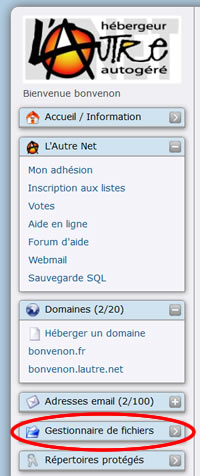

L'interface se décompose en plusieurs zones.

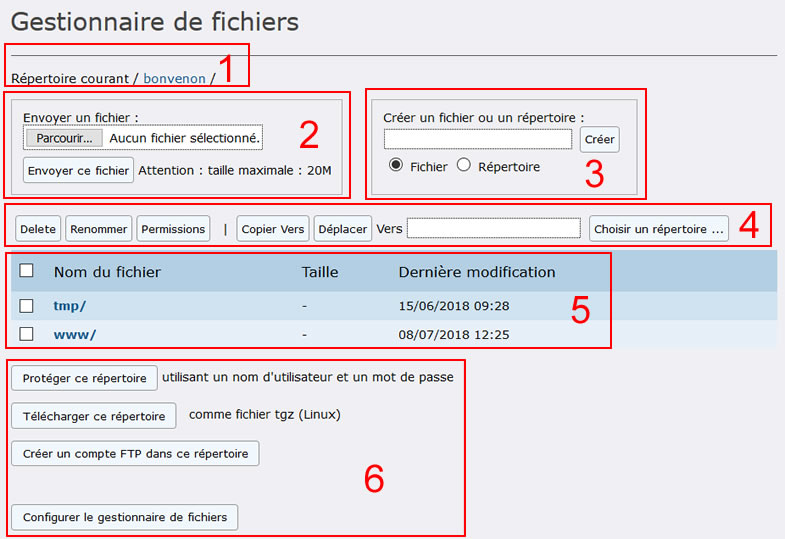

1. En haut le répertoire que nous sommes en train de visualiser /*bonvenon*/ : nous sommes à la racine du compte *bonvenon*, racine symbolisée par la barre oblique (/) après le nom de compte

2. Au dessous une zone de téléchargement de fichier (upload) depuis votre ordinateur vers les serveurs de lautre.net.

3. En haut à droite une zone de création  
Pour l'utiliser sélectionner "Fichier" ou "Répertoire", puis inscrire un nom de fichier dans la zone de texte (pour les fichiers ne pas oublier l'extension : le point et les quelques caractères qui suivent .txt .html ...), pour créer le fichier, ou le répertoire souhaité.  

4. Au centre une zone de manipulation des fichiers présents : copie, déplacement, renommage, suppression ...

5. Sous cette zone de manipulation, la liste des répertoires et fichiers présents dans ce répertoire.

6. Une zone de lien permettant diverses actions  

## Création d'un répertoire, d'un fichier

Déplaçons nous dans le dossier "www" puis le dossier "*bonvenon*.lautre.net".  
Pour cela cliquons sur le nom du répertoire "www/" (carré rouge zone 5) puis "*bonvenon*.lautre.net/".

Maintenant que le "Gestionnaire de fichiers" nous présente les fichiers et répertoires contenus dans le dossier "/*bonvenon*/www/*bonvenon*.lautre.net/ " cocher le bouton radio « Répertoire » et saisir le nom du répertoire dans la zone texte, dans notre exemple « site » (ovale rouge) puis cliquer sur le bouton "Créer" (rectangle rouge)

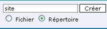

Le répertoire "site/" apparaît dans la liste des fichiers et répertoires, avec la date et l'heure de création.
Il est inscrit en **gras** et son nom est suivi d'une barre oblique (c'est ce qui indique qu'il s'agit d'un répertoire)

Contrairement au fichier « index.php » il n'est pas suivi du lien « Voir ». Ce lien, « Voir » permet de visualiser dans un navigateur internet le contenu du fichier (donc impossible pour un répertoire).

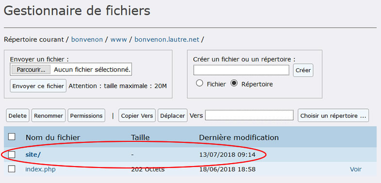

Nous allons **créer un nouveau fichier (document)** que nous nommerons « index.html » (bien sélectionner le bouton radio « Fichier » avant de cliquer sur le bouton "Créer" !).

Le fichier "index.html apparait dans le répertoire "/*bonvenon*/www/*bonvenon*.lautre.net/".

Nous allons maintenant modifier le contenu de ce fichier.  
Pour cela il suffit de cliquer sur le nom du fichier "index.html".  

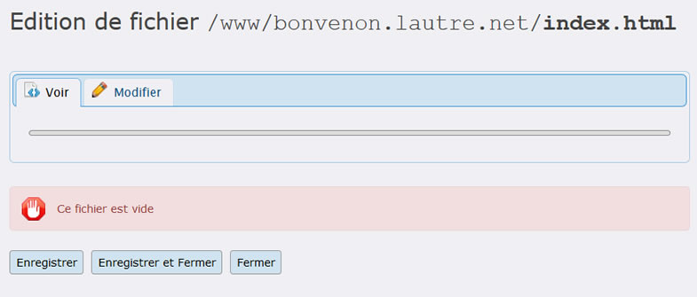

Le fichier étant vide l'onglet "Voir" n'affiche que "Ce fichier est vide" sinon nous aurions un aperçu du contenu du fichier.

Sélectionnons l'onglet "Modifier".
Dans la zone de texte (ovale rouge) inscrivons une phrase (ATTENTION, il ne s'agit pas d'un contenu html valide).

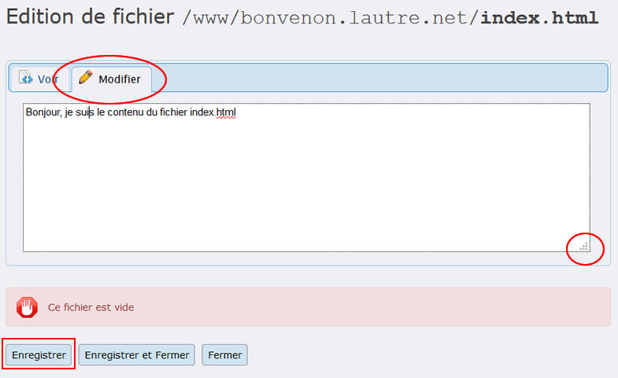  

Remarque : La zone de texte peut être ajustée en largeur et hauteur. Pour cela cliquer sur la zone en bas à droite de la zone de texte (rond rouge) puis, tout en gardant le bouton de votre souris enfoncé, déplacer votre souris à l'emplacement désiré.

Cliquer sur le bouton "Enregistrer" (Rectangle rouge) pour retourner au gestionnaire de fichiers (Remarque : le bouton "Enregistrer et Fermer" n'est pas fonctionnel pour le moment).

L'onglet "Voir" affiche maintenant un aperçu du contenu du fichier.

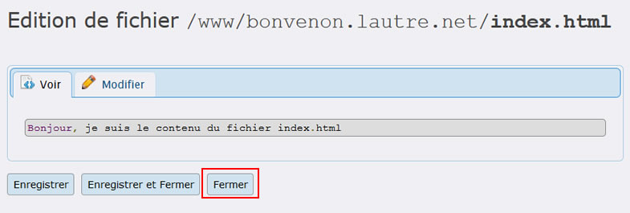

Cliquer sur le bouton "Fermer"

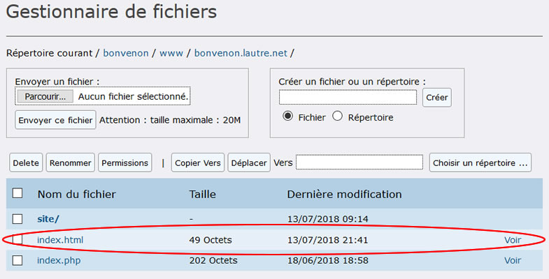

La zone informative indique que le fichier a bien été enregistré (date et heure), le poids du fichier est passé de 0 à 49 octets.  

## Manipuler des fichiers ##

### Déplacement ###

Nous allons déplacer le fichier « *index.html* » dans le répertoire "site".  
Cocher la case à gauche du nom du fichier (rond rouge) puis cliquer sur le bouton "Choisir un répertoire ..." (rectangle rouge).

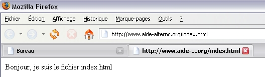

Une petite fenêtre s'ouvre  

Cliquer sur le nom du répertoire "www" puis "bonvenon.lautre.net" puis "site" (ovales rouges), puis cliquer sur le bouton "Sélectionner" (rectangle rouge).  

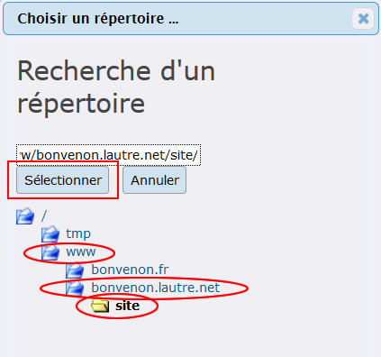

Cliquer sur le bouton "Déplacer" (Rectangle rouge).

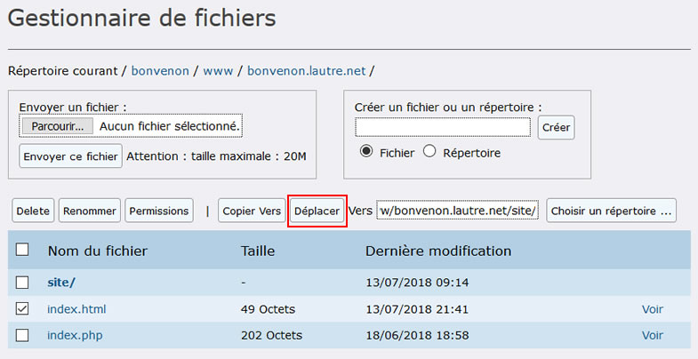

Le fichier ne s'affiche plus dans le gestionnaire de fichiers, il est dans le répertoire "site", pour le retrouver il suffit de cliquer sur le nom "site/".  

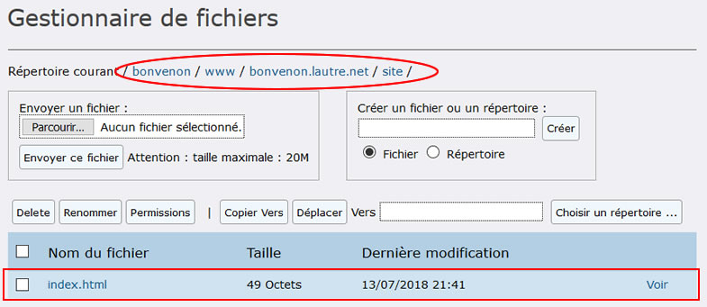  

Observons le gestionnaire de fichiers : la zone informative affiche le chemin depuis la racine du compte *bonvenon*: /*bonvenon*/www/*bonvenon*.lautre.net/site/ (ovale rouge)  

La liste des fichiers et répertoires se résume au seul fichier présent dans le répertoire "site", le fichier "index.html" que nous venons de déplacer (rectangle rouge).

Si nous ouvrons ce fichier dans un navigateur (lien « Voir »), l'adresse dans la barre d'URL est devenue : http://www\.*bonvenon*.lautre.net/site/index.html.

Nous allons supprimer le fichier "index.php" qui se trouve dans le répertoire "/bonvenon/www/bonvenon.lautre.net/" .

Celui qui s'affiche quand nous accédons à notre domaine sur internet.

Revenons au répertoire précédent en cliquant sur "*bonvenon*.lautre.net"  dans le nom du dossier courant (en haut).  

Sélectionner le fichier « index.php » (clic sur la case à gauche du nom pour la cocher), puis cliquer sur le bouton "Delete". Le fichier disparaît.

Soyons curieux : que se passe-t-il si nous inscrivons l'URL http://www\.bonvenon.lautre.net dans la fenêtre d'un navigateur ?  

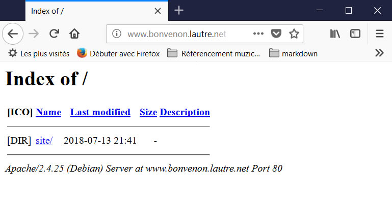  

Aucun fichier index n'étant trouvé à la racine du site, le navigateur affiche la liste des répertoires présents et autres fichiers  (ici le répertoire "site").

Pour faire pointer la racine du site vers notre dossier "site/" il suffit de modifier le répertoire paramétré dans le champ "Hébergé localement" du sous-domaine "www\.*bonvenon*.lautre.net" (voir la rubrique [bienvenue](http://aide.lautre.net/bienvenue-a-lautre-net.html) de l'aide.)

