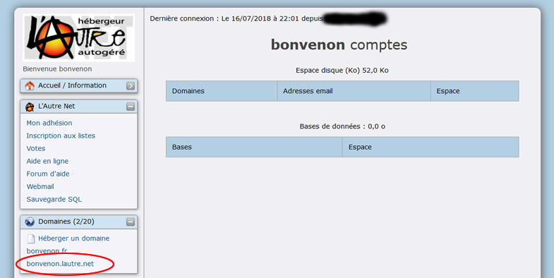
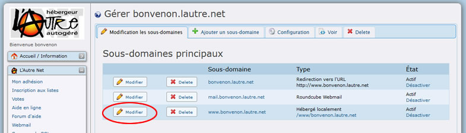
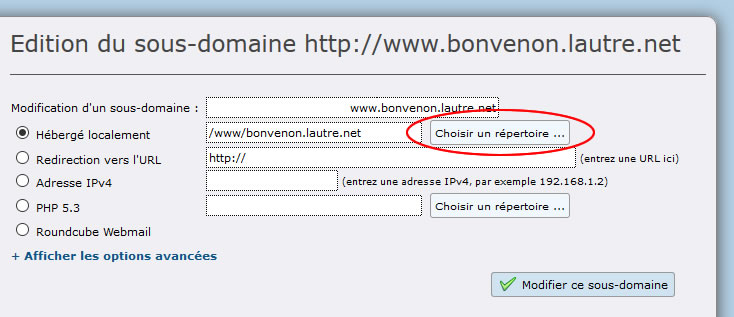
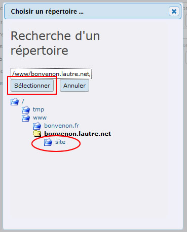
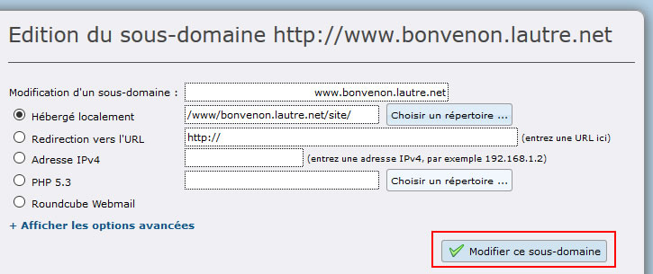
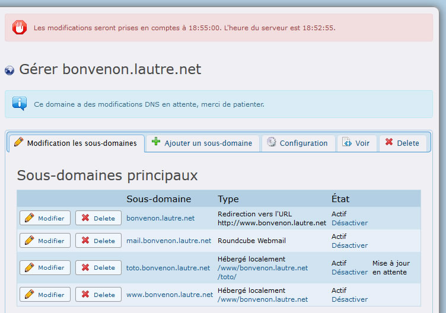
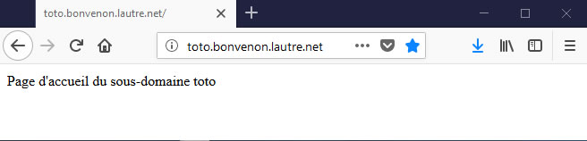

Title: 03. Gérer domaine et sous-domaine 
Date: 2018-06-05 11:46:44
Category: 04. Gestion d'un compte
Tags: old
Summary: Comment faire pointer un nom de domaine ou un sous-domaine vers un répertoire spécifique de votre compte AlternC.

Depuis le bureau virtuel AlternC il est très aisé de diriger un domaine ou un sous-domaine vers le répertoire de son choix.

## Modifier le chemin d'un nom de domaine

Dans le menu du bureau virtuel, cliquer sur le lien « *bonvenon*.lautre.net » dans la rubrique « Domaines ». Cette action affiche un formulaire dans la partie droite du bureau virtuel.

Il s'agit de faire pointer le nom de domaine installé vers le répertoire « *site* ».

Attention, compter 5 minutes après chaque manipulation pour que les modifications soient prises en compte, comme indiqué dans le paragraphe [01-Nom de domaine](http://aide.lautre.net/01-nom-de-domaine.html).  
En effet un « cron » (programme s'exécutant automatiquement), se déclenche toutes les 5 minutes sur le serveur pour mettre à jour les noms de domaines et sous-domaines installés.

Nous remarquons que "*bonvenon*.lautre.net" pointe vers "www\.*bonvenon*.lautre.net" lui même hébergé localement dans le répertoire "/www/*bonvenon*.lautre.net".

Cliquer sur le bouton "Modifier" (Ovale rouge) sur la ligne du domaine "www\.*bonvenon*.lautre.net".

Conserver la sélection  "Hébergé localement" et cliquer sur le bouton "Choisir un répertoire ..." 

Dans la petite fenêtre qui s'ouvre « Choisir un répertoire » cliquer sur le nom du répertoire "site" (ovale rouge), puis valider le choix avec le bouton "Sélectionner" (rectangle rouge), comme nous l'avions fait pour  [Manipuler des fichiers](http://aide.lautre.net/02-repertoires-et-fichiers.html)

Dans la partie droite du bureau les informations ont été prises en compte : cliquer sur le bouton "Modifier ce sous-domaine" (rectangle rouge)

En inscrivant l'URL "www\.*bonvenon*.lautre.net" dans une fenêtre de navigateur, nous ouvrons maintenant, directement le fichier "index.html" du répertoire "site".  
Il en est de même pour l'URL "*bonvenon*.lautre.net", puisqu'elle renvoie vers "www\.*bonvenon*.lautre.net".

Poursuivons nos manipulations en installant un sous-domaine.

## Création d'un sous-domaine

Nous allons installer un sous-domaine sur le compte "*bonvenon*" et faire pointer ce sous- domaine vers un répertoire créé pour l'occasion.
La première étape consiste à créer le répertoire.

  -  **Création du répertoire**  
A la racine du compte créons le répertoire "toto", comme nous avons créé le répertoire "site" dans [02 Repertoires et fichiers](http://aide.lautre.net/02-repertoires-et-fichiers.html).

  -  **Création du sous-domaine**  
Cliquer sur le lien "*bonvenon*.lautre.net" dans la rubrique "Domaines" du menu du bureau virtuel.   
Cliquer sur l'onglet "Ajouter un sous-domaine"  
Dans le champ "Création d'un sous-domaine" saisir "toto" avant ".*bonvenon*.fr"  
Sélectionner « Hébergé localement» puis cliquer sur le bouton "Choisir un répertoire ..."  
Dans la petite fenêtre, cliquer sur le nom des répertoires jusqu'au répertoire "/www/*bonvenon*.lautre.net/*toto*", puis valider le choix en cliquant sur le bouton "Sélectionner".  
Enfin, cliquer sur le bouton "Ajouter un sous-domaine".

Le sous-domaine figure maintenant dans la liste affichée.

Pour ne pas perdre de temps, nous allons mettre à profit les 5 minutes d'attente, avant la prise en compte de ce sous-domaine, pour créer le fichier "index.html" dans le répertoire "toto".

Dans le menu (partie gauche du bureau virtuel), cliquer sur le lien « Gestionnaire de fichiers ».

  -  **Création du fichier "index.html" du répertoire "toto"**  
Accéder au "gestionnaire de fichier".
Ouvrir le répertoire "/*bonvenon*/www/*bonvenon*.lautre.net/toto/ en cliquant sur le nom des répertoires correspondants.
Créer un fichier "index.html" dans ce répertoire.  
Modifier ce fichier : cliquer sur son nom puis sur l'onglet "Modifier".   
Saisir le code suivant : `Page d'accueil du sous-domaine toto`  
Ensuite cliquer sur le bouton "Enregistrer" puis sur le bouton "Fermer".

  -  **Vérification**  
Si l'opération nous a pris plusieurs minutes il y a de grandes chances que le sous-domaine « toto.aide-alternc.org  » soit pris en compte sur le serveur.
Pour le vérifier, ouvrir un nouvel onglet ou une fenêtre du navigateur et inscrire l'URL http://toto\.*bonvenon*.lautre.net (attention sans les www !)  
  
Voici le résultat dans un nouvel onglet du navigateur Firefox.

 

