Title: 04. Import de fichiers et FTP 
Date: 2018-06-04 17:38:59
Category: 04. Gestion d'un compte
Tags: old
Summary: Comment importer des fichiers, voire les modifier, de manière aisée depuis le bureau virtuel d'AlternC. 

AlternC facilite l'import de fichiers directement depuis le bureau virtuel ou, plus classiquement, par FTP.

## Importer un fichier depuis le gestionnaire de fichiers

Nous allons agrémenter la page "toto" avec une image. Cette image se trouve sur le disque dur de notre ordinateur. Pour la transférer nous  allons utiliser la zone de téléchargement (upload) du gestionnaire de fichier.

accèder au répertoire "toto" dans le gestionnaire de fichiers.  
Dans le cadre "Envoyer un fichier" Cliquer sur le bouton "Parcourir" et choisir l'image sur le disque dur votre ordinateur (dans notre exemple : "lautre.png").
Cliquer sur le bouton "Envoyer" (rectangle rouge).

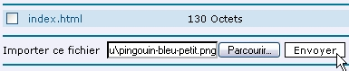

le fichier apparaît dans la liste du répertoire "toto"».
Ce petit outil intégré au bureau AlternC est très pratique pour télécharger un fichier.

## Renommer un fichier

Le nom de l'image est un peu long, nous allons renommer le fichier image.  

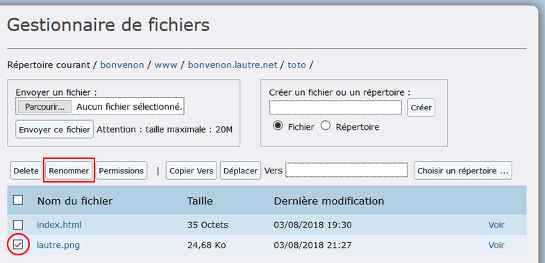  

Sélectionner la case qui précède le nom de l'image (rond rouge).
Puis cliquer sur le bouton "Renommer" (rectangle rouge)

Dans la zone de texte (ovale rouge) modifier le nom en "Logo lautre"(Attention, bien conserver l'extension (ici « .jpg »).
puis cliquer sur le bouton renommer (rectangle rouge).  

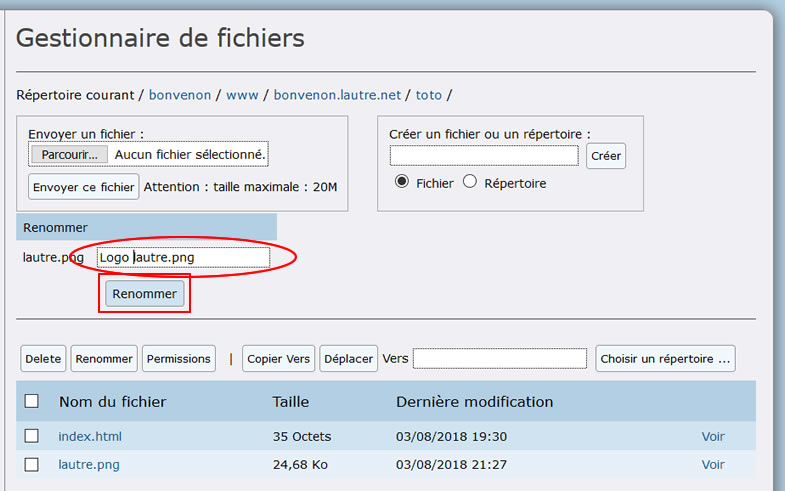  

Le nom du fichier image a été modifié dans la liste des fichiers.  

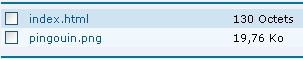  

Pour l'intégrer à la page d'accueil du sous-domaine « toto.*bonvenon*.lautre.net » nous allons simplement modifier le fichier « index.html » du répertoire « toto ».

Cliquer sur le lien « index.html » (ovale rouge)  

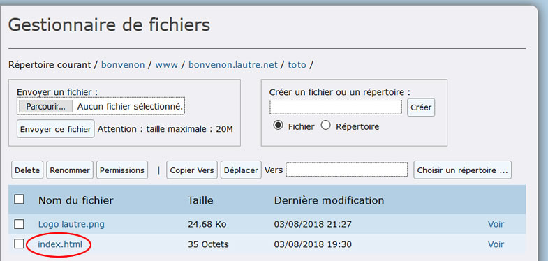

Sélectionner l'onglet "Modifier" (ovale rouge) 

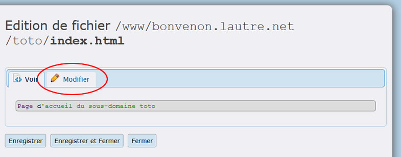  

Ajouter au debut du texte :
`` (ovale rouge)
 
Puis cliquer sur le bouton "Enregistrer" (rectangle rouge)  

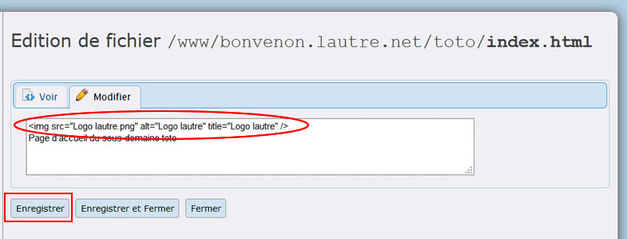  

Enfin cliquer sur le bouton "fermer" (rectangle rouge)  

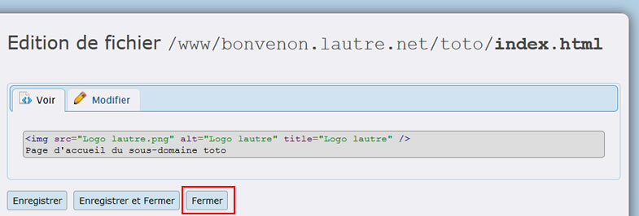

Pour visualiser la page modifiée cliquer sur le lien « Voir » qui suit le fichier « *index.html* ».

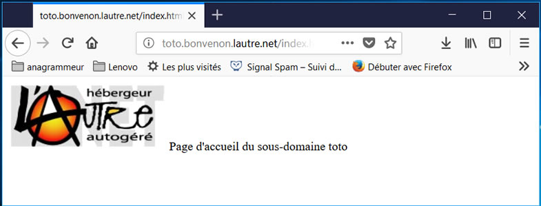  

Si le logo n’apparaît pas forcer le rechargement de la page (en appuyant sur les touches \[Ctrl]+F5 pour la plupart des navigateurs)  

Comme l'outil FTP,  les fonctionnalités de création, édition, déplacement, copie ... du gestionnaire de fichiers sont très utiles pour corriger une faute d'orthographe, une date... dans un fichier.

Toutefois pour mettre à jour un site (télécharger de nombreux fichiers) il vaut mieux utiliser un client FTP traditionnel.
Nous allons justement aborder ce point.

### Compléments sur les fichiers et répertoires

accéder au gestionnaire de fichier à la racine du compte (s'il est ouvert sur un des répertoires « toto » ou « site », cliquer sur le lien "/*bonvenon*" à côté de "Répertoire courant"

Au-dessous de la liste des fichiers se trouve 4 boutons que nous allons étudier.

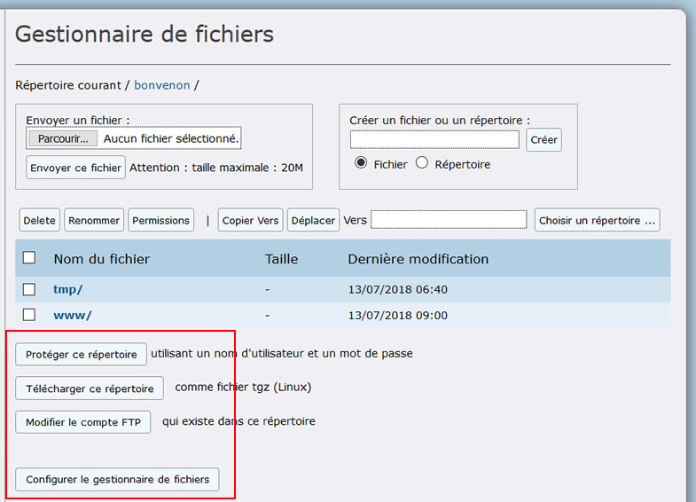

## Créer un compte FTP rapidement

Cliquer sur le bouton "Modifier le compte FTP"  

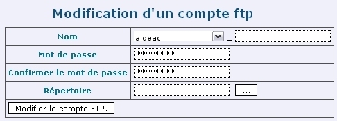  

Lors de votre souscription à l'association, un compte FTP est automatiquement créé à la racine du compte, avec le même nom et mot de passe. Il donne accès, en lecture et écriture, à tous les répertoires, sous-répertoires et fichiers du compte.

Son nom comporte obligatoirement soit le nom du compte, soit le nom de domaine installé sur ce compte. Il peut être complété par un autre nom (caractères non accentués) à inscrire dans la zone texte qui suit le « _ » (ovale rouge 1).

Un compte FTP peut être limité à certains fichiers et sous-répertoires d'un répertoire spécifique et non pas à l'ensemble des fichiers et répertoires.
Pour cela, cliquer sur le bouton "Choisir un répertoire ..." (ovale rouge 2)   

Modifier le mot de passe peut être utile pour donner accès aux fichiers du compte à un client FTP classique, sans donner accès à la gestion du compte (noms de domaines, adresses mail ...).
Pour cela, cliquer sur le lien "Cliquez ici pour modifier le mot de passe" (ovale rouge 3) puis saisissez deux fois le nouveau mot de passe. Vous pouvez demander la génération de mot de passe en cliquant sur le lien "Cliquez ici pour générer un mot de passe"  

Puis valider les changements en cliquant sur le bouton "Enregistrer".

Il n'y a pas de compte FTP pour les répertoires « toto » et « site ». Vérifier en ouvrant le gestionnaire de fichiers sur ces répertoires.  
Le bouton propose, « Créer un compte FTP dans ce répertoire ».

Un clic sur bouton ouvre le formulaire de création d'un compte ftp pour ce répertoire 

## Créer, gérer et configurer un compte FTP

Une autre méthode, la plus classique en fait,  pour créer un compte FTP est de cliquer dans le menu de gauche du bureau virtuel sur le lien « Liste des comptes ftp » (ovale rouge). 

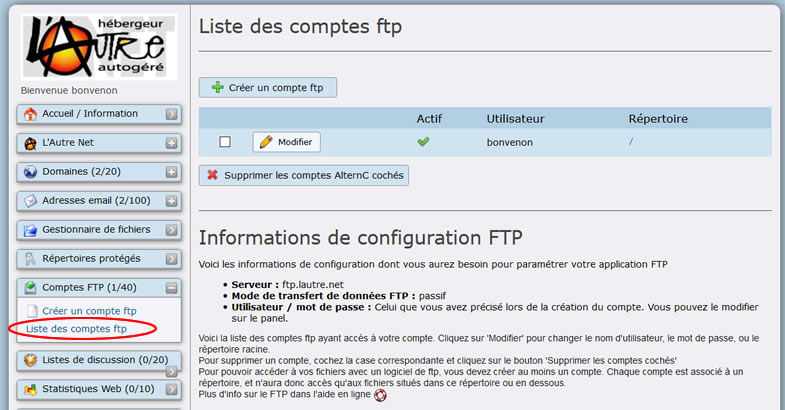  

Cette méthode offre les mêmes possibilités que l'entrée par le bouton du gestionnaire de fichiers et affiche la liste de tous les comptes FTP.

Pour chaque compte ftp, le nom du compte et le répertoire concerné (rappel : / signifie la racine du compte)  sont précédés d'un bouton  "Modifier" et d'une case à cocher permettant la suppression du compte après sélection de la case et clic sur le bouton "Supprimer les comptes AlternC cochés".

Il est possible de créer plusieurs comptes FTP pour un même répertoire.

## Configurer son logiciel FTP

Vous pouvez utiliser un de ces comptes FTP immédiatement : entrez les paramètres suivant dans votre client FTP favori (par exemple Filezilla) :

  -  Hôte : ftp.lautre.net (ovale rouge 1)
  -  Utilisateur : votre nom de compte ftp (le nom du compte (ici "*bonvenon*") (ovale rouge 2)
  -  Mot de passe : le mot de passe que vous avez entré (à ne pas oublier donc !). Si vous oubliez votre mot de passe, vous pouvez le modifier en accédant à la gestion des comptes FTP. En effet, vous ne retrouverez pas votre mot de passe car il est stocké chiffré sur le serveur. Vous pourrez seulement le modifier (ovale rouge 3).
  -  Cliquer sur le bouton "Connexion rapide" (rectangle rouge).

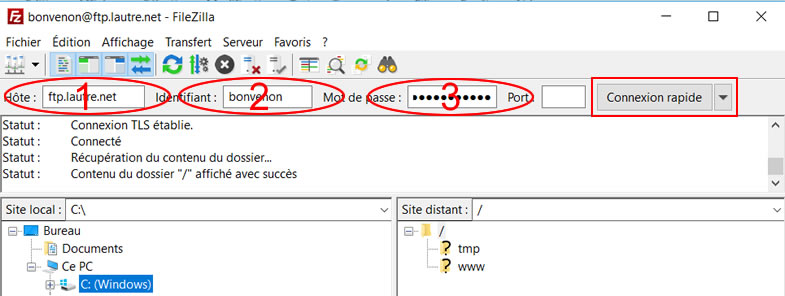

**Attention,** avec la configuration ci-dessus toutes les données transférées par FTP, y compris votre identifiant et votre mot de passe, sont transmises "en clair", et sont donc lisibles librement par quiconque "écouterait" quelque part le long de la connexion entre votre ordinateur et le serveur FTP. Il est donc **vivement** conseillé, pour des raisons de sécurité, de mettre en place une connexion sécurisée, où vos identifiant, mot de passe et données sont chiffrées et donc illisibles par un tiers.

## Récupérer des fichiers compressés

Le deuxième bouton, au bas du gestionnaire de fichiers, est :  "Télécharger ce répertoire" offre au gestionnaire du compte la possibilité de télécharger (download) l'ensemble des fichiers d'un répertoire compressés automatiquement.

Pour effectuer cette action il suffit de cliquer sur le bouton puis d'indiquer selon votre navigateur l'action (ouverture ou enregistrement) a effectuer ainsi que le répertoire du disque dur dans lequel il doit être stocké si vous avez choisi de l'enregistrer.

Attention la compression se fait ici au format tgz qui est un format reconnu le plus souvent par les systèmes Linux, mais le format peut être modifié dans la configuration du gestionnaire de fichier, comme nous l'expliquons dans l'article sur la [configurer le gestionnaire de fichiers](http://aide.lautre.net/06-configurer-le-gestionnaire-de-fichiers.html)

