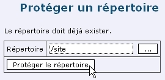
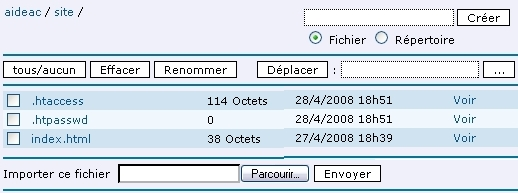
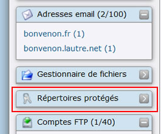
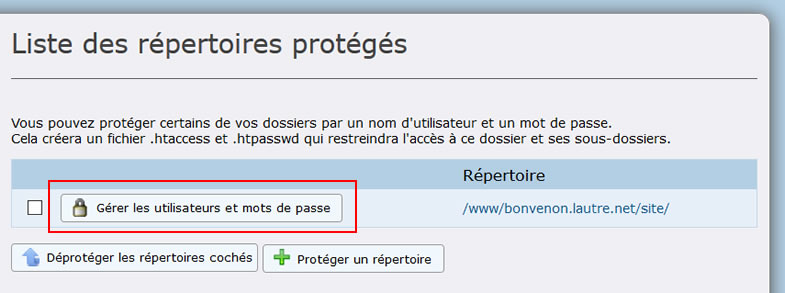
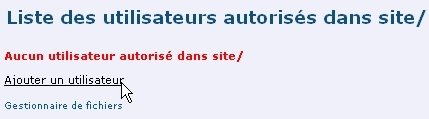
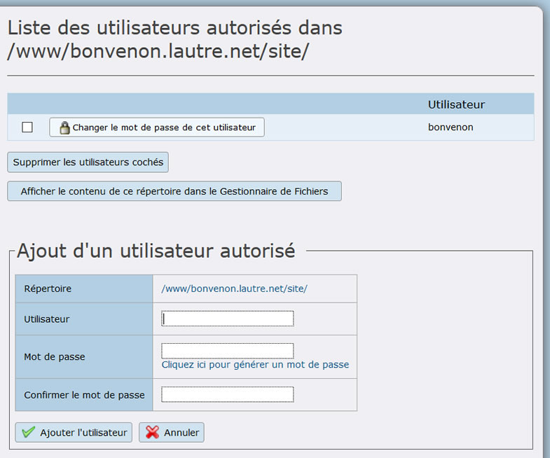
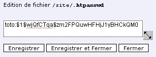

Title: 05. Protéger un répertoire 
Date: 2018-06-03 14:55:00 
Category: 04. Gestion d'un compte
Tags: old
Summary: Comment limiter l'accès de répertoires de votre site aux seuls visiteurs autorisés.  

Vous souhaitez peut-être interdire la consultation publique de répertoires d'un site en la limitant à des visiteurs privilégiés. Ce peut-être un album photos, des pages réservées aux adhérents d'une association...  
AlternC génère automatiquement les fichiers de protection nécessaires (« .htaccess » et « .htpasswd »)

## Répertoires protégés

Dans le gestionnaire de fichiers, le second lien « Cliquer ici pour protéger ce répertoire par un login / mot de passe », permet de protéger un ensemble de fichiers en limitant leur lecture aux utilisateurs autorisés.

Ouvrir le répertoire "site" dans le gestionnaire de fichiers et cliquer sur le bouton "Protéger ce répertoire",

Valider en cliquant sur le bouton "Protéger ce répertoire"

Ouvrir à nouveau le répertoire "site" dans le gestionnaire de fichiers.
Deux nouveaux fichiers « .htaccess » et « .htpasswd » ont été générés.  

  

Le fichier « .htpasswd » ne contient aucune donnée (0 octet), Vérifier en l'éditant : il est vide. Aucun utilisateur n'est autorisé à visualiser les fichiers du répertoire.

Pour créer un utilisateur autorisé, cliquer sur le lien « Répertoires protégés » dans le menu du bureau.  

  

  

Cliquer sur le bouton "Gérer les utilisateurs et mots de passe"

Saisir le nom de login dans le champ utilisateur (pas de caractère accentué, ovale orange 1)  
et deux fois le mot de passe (ovale orange 2).

Puis cliquer sur le bouton "Ajouter l'utilisateur"   Valider en cliquant sur le bouton [Ajouter l'utilisateur].

L'utilisateur a été enregistré.

  

Maintenant le fichier « .htpasswd » du répertoire "site" pèse quelques octets et contient des données. Vérifier en l'éditant (cliquer sur le nom du fichier ".htpasswd" dans le dossier site du gestionnaire de fichier):

Le nom est affiché en clair, le mot de passe est hashé (MD5). S'il est perdu, il est irrécupérable, la seule solution est de le modifier (modification que seule la personne ayant accès au bureau virtuel du compte ou ayant un accès FTP peut effectuer).
