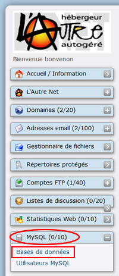
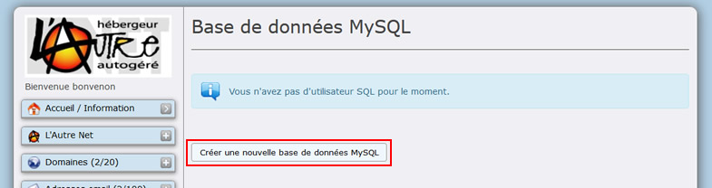
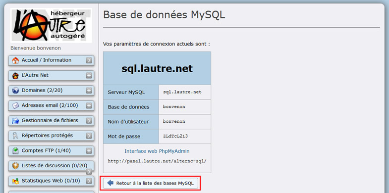
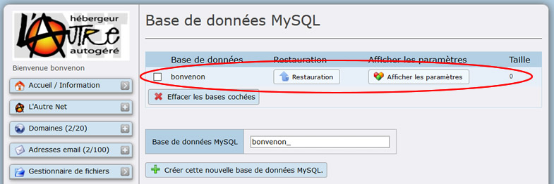
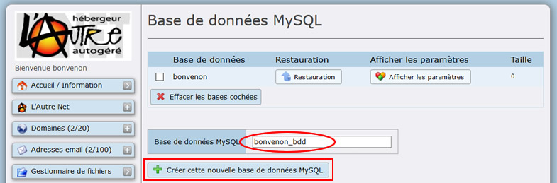
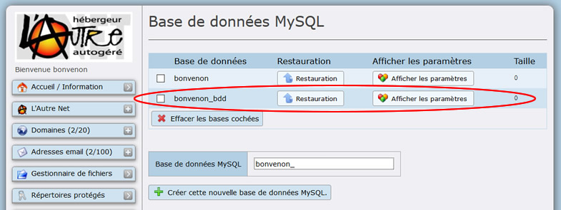
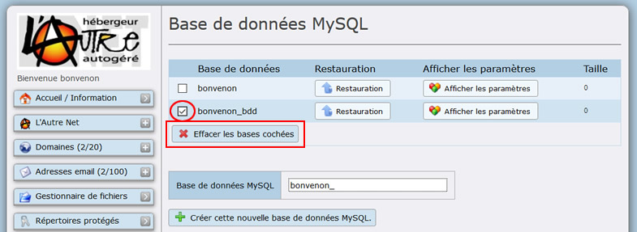
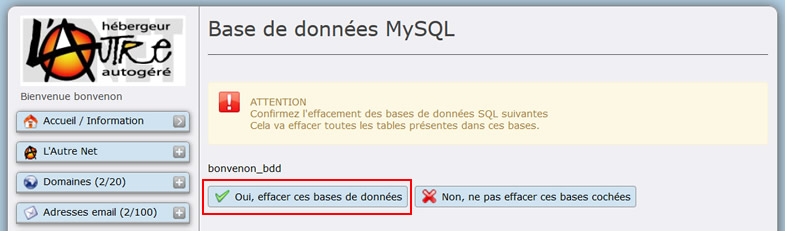
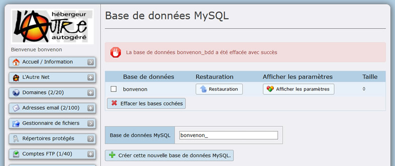

Title: 01. Créer une base de données  
Date: 2018-11-03 17:03:21
Category: 05. Gestion bases de données
Tags: old
Summary: Création d'une base de donnée

Contrairement à la création automatique d'un compte FTP lors de la création d'un compte Alternc, aucune base de données n'est créée automatiquement.  

En effet, tous les outils web n'utilisent pas des bases de données.  

Si le gestionnaire du compte AlternC a besoin de ces bases il peut facilement les créer. Leur nombre maximum dépend du quota qui a été attribué à la création du compte AlternC.

## Créer la base de données principale

  

Dans le menu de gauche du bureau virtuel, la rubrique MySQL vous indique qu'il n'existe, sur ce compte, aucune base de données. Le nombre maximal autorisé est de 10 (Ovale rouge).

Cliquez sur le lien "Base de données" (Rectangle Rouge)

Cliquez sur le bouton "Créer un nouvel utilisateur MySQL" (Rectangle Rouge)

Cliquer sur le bouton "Retour à la liste des bases MySQL" (Rectangle Rouge).  

La base de données apparaît (Ovale Rouge).

## Créer une nouvelle base de données

Pour créer une nouvelle base, dans le menu du bureau, cliquez sur le lien "Bases de données" sous la rubrique MySQL.  

Saisir le nom de la nouvelle base dans le champ "Base de données MySQL" "*bonvenon*_" (Ovale Rouge).  
Puis cliquez sur le bouton "Créer une nouvelle base de données MySQL" (Rectangle Rouge).

Cliquer sur le bouton "Retour à la liste des bases MySQL"

La base apparaît maintenant dans la liste des bases de données.

## Supprimer une base de données

Cochez la case à gauche du nom de la base de données (Rond Rouge), puis cliquez sur le bouton "Effacer les bases cochées" (Rectangle Rouge).

La base sera effacée (pour éviter toute mauvais manipulation, une confirmation sera demandée)

Cliquer sur le bouton "Oui, effacer ces bases de données" (Rectangle Rouge) pour confirmer la suppression.

L'écran "Base de données MySQL" confirme la suppression.

