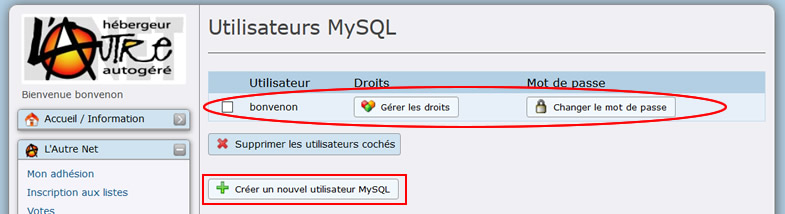
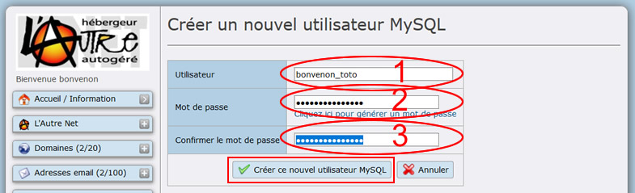
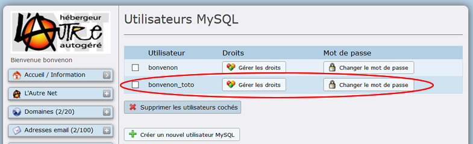
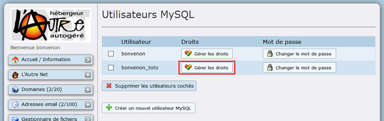
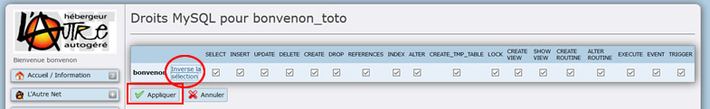
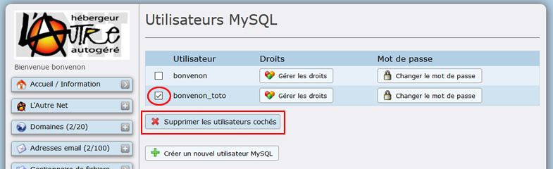
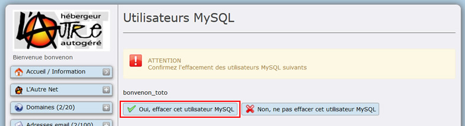
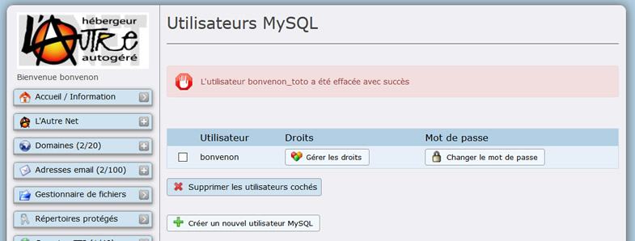

Title: 02. Utilisateurs MySQL 
Date: 2018-09-02 08:32:40
Category: 05. Gestion bases de données
Tags: old
Summary: Gestion des utilisateurs MySQL

Créer plusieurs utilisateurs MySQL permet de donner la main à un créateur de site web (par exemple) sans lui donner accès au bureau AlternC. 

Avec un compte FTP et un compte Utilisateur MySQL, vous voici parés pour confier la réalisation d'un site web, par exemple, sans donner accès à votre comte AlternC (messagerie, statistiques, listes de diffusion... resteront confidentielles). 

## Créer un utilisateur MySQL

Cliquez sur ce lien "Utilisateur MySQL" dans le menu "MySQL" du bureau.

L'utilisateur créé à la création de la première base de données "*bonvenon*" apparaît (Ovale Rouge).

Cliquer sur le bouton "Créer un nouvel utilisateur MySQL" (Rectangle Rouge).

Saisir le nom d'utilisateur dans le champ "Utilisateur" préfixé par "*bonvenon*" (Ovale Rouge 1).  
Saisir le mot de passe (Ovale Rouge 2).  
Puis le confirmer (Ovale Rouge 3).

Enfin cliquer sur le bouton "Créer ce nouvel utilisateur MySQL" (Rectangle Rouge)

- le nom d'utilisateur sera toujours précédé du nom du compte suivi d'un souligné (tiret du 8). Attention, le nom d'utilisateur est limité à 16 caractères.
- Bien évidemment le mot de passe peut être différent de celui que vous avez entré lors de la création de la base de données principale.

le nouvel utilisateur apparaît dans la liste des utilisateurs MySQL.

## Donner des droits à un utilisateur MySQL

Pour le moment, cet utilisateur n'a aucun droit quelque soit base.  
Nous allons lui en donner. Pour cela cliquer sur le bouton "Gérer les droits" à droite du nom d'utilisateur.

Cliquer sur le lien "Inverse la sélection" (Rond Rouge), pour tout sélectionner.

Puis cliquer sur bouton "Appliquer".

**A réserver aux spécialistes SQL :**  
Vous pouvez choisir les droits que vous souhaitez lui octroyer en cochant les cases individuellement.

"*bonvenon*\_toto" aura donc des droits sur la base "*bonvenon*", base à laquelle il pourra accéder avec le logiciel [PHPMyadmin](https://admin.lautre.net/alternc-sql/)
Pour de plus amples informations [voir PHPMyAdmin](http://aide.lautre.net/03-phpmyadmin.html).

## Supprimer un utilisateur MySQL

Sélection la case à cocher correspondant à l'utilisateur à supprimer (Rond Rouge).

Puis cliquer sur le bouton "Supprimer les utilisateurs cochés" Rectangle Rouge).

Confirmer la suppression en cliquant sur le bouton "Oui, effacer cet utilisateur MySQL" (Rectangle Rouge)

