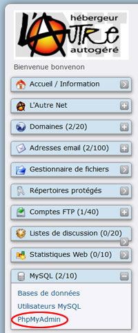
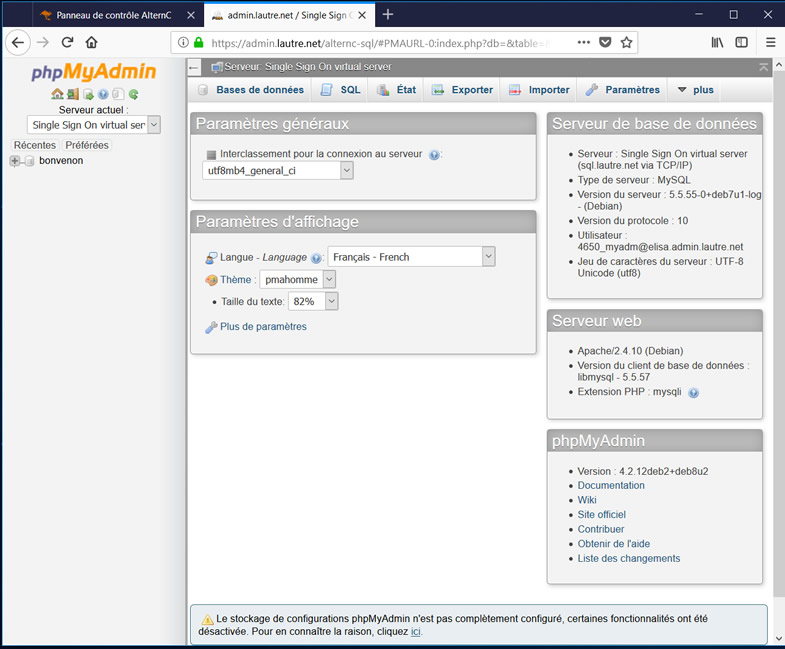
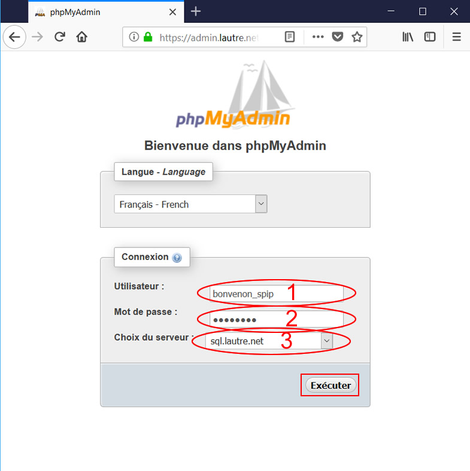

Title: 03. phpMyAdmin 
Date: 2018-09-01 08:45:56
Category: 05. Gestion bases de données
Tags: old
Summary: Présentation phpMyAdmin.

"phpMyAdmin" est un logiciel libre qui permet de gérer des bases de données SQL en mode graphique. L'objet de cette aide est de présenter "phpMyAdmin", et non d'exposer ses nombreuses possibilités.

Sa manipulation doit faire l'objet de précautions. Certes il n'est pas nécessaire d'être administrateur-système confirmé pour en faire une utilisation basique, toutefois son utilisation est déconseillée aux personnes qui n'ont aucune connaissance dans le domaine des bases de données.

## Accès depuis le bureau AlternC

Pour accéder à "phpMyAdmin" depuis le bureau AlternC cliquer sur le lien "phpMyAdmin" de la fenêtre "MySQL" (Ovale Rouge)

"phpMyAdmin" se présente sous la forme d'une interface graphique;

Vous n'êtes pas obligé d'utiliser "phpMyAdmin" pour créer une base de données. Vous pouvez le faire en utilisant le bureau virtuel de votre compte AlternC comme indiqué dans ["01 Créer une base de données"](http://aide.lautre.net/01-creer-une-base-de-donnees.html).

## Accès depuis le net

Si vous confiez la réalisation de votre site web (par exemple) à un tiers  n'ayant pas accès au bureau virtuel il faut procéder ainsi :

- Créer depuis le bureau virtuel AlternC la base de données ou les bases de données dont il a besoin, voir ["01 Créer une base de données"](http://aide.lautre.net/01-creer-une-base-de-donnees.html).
- Modifier le mot de passe de l'utilisateur qui a été créé lors de la création de la base de données ou créer un nouvel utilisateur, voir ["02. Utilisateurs MySQL"](http://aide.lautre.net/02-utilisateurs-mysql.html)
- Donner les droits souhaités à l'utilisateur
- Créer, si ce n'est déjà fait un compte FTP spécifique,  voir ["04. Import de fichiers et FTP"](http://aide.lautre.net/04-import-de-fichiers-et-ftp.html).
- Transmettre l'adresse de l'interface phpMyAdmin sur le serveur, soit https://admin.lautre.net/alternc-sql/index.php.  
Pour la connexion utiliser le nom du l'utilisateur (Ovake Rouge 1), le mot de passe (Ovale Rouge 2) et "sql.lautre.net" dans le champ "choix su serveur" (Ovale Rouge 3).

Puis cliquer sur le bouton "Exécuter".

**Testez que tout fonctionne AVANT de transmettre l'ensemble de ces informations.**
