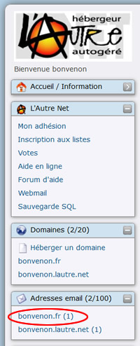
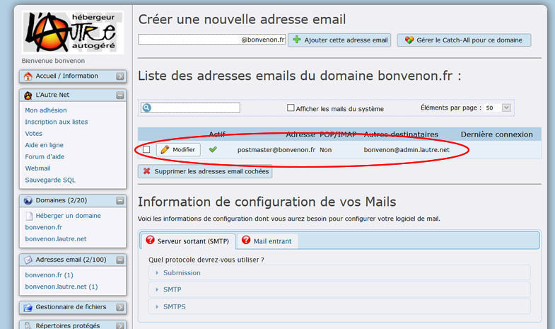
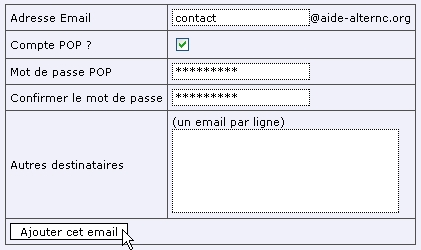
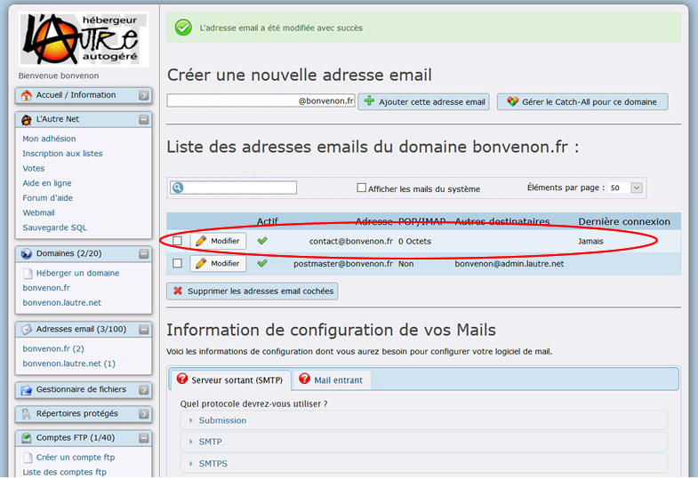

Title: 01. Mails et alias 
Date: 2018-10-02 11:41:51
Category: 06. Gestion messagerie
Tags: old
Summary: Comment créer Mails et alias de manière aisée depuis le bureau virtuel d'AlternC.

Dans cette section, nous allons décrire la gestion du courrier électronique.

## Menu de gestion des mails

Dans la fenêtre "Adresses email" du menu, cliquez sur le lien "*bonvenon*.fr" (Ovale rouge).

Une adresse mail a été générée automatiquement à l'installation du domaine.  
  
Même si cette adresse ne paraît pas utile, il ne faut pas la supprimer.  
En effet, sa présence est testée par certains registrars  pour des noms de domaines testés **avant** leur acquisition (cas des noms de domaine en .fr par exemple), cette dernière peut être refusée si l'adresse n'est pas présente.  
Il est tout à fait possible de la diriger vers une autre adresse, selon la procédure que nous verrons plus loin.  
Il s'agit de l'adresse "postmaster@*bonvenon*.fr" (Ovale rouge).

  
AlternC offre la possibilité de créer un "vrai" compte mail, consultable par votre logiciel de mail ou par le web, ou de créer un alias (redirection d'une adresse mail vers une ou plusieurs adresses existantes). On peut par ailleurs panacher ces fonctions à souhait.

Nous allons créer l'adresse "contact@*bonvenon*.fr", dont nous nous servirons pour la configuration du logiciel de mail et du webmail.

Ajouter le nom de l'adresse mail avant "@*bonvenon*.fr" (Ovale rouge)  
Puis valider en cliquant sur le bouton "Ajouter cet adresse email" (Rectangle rouge).

## Création d'une adresse mail

 

Comme indiqué dans l'ovale rouge 

- Sélectionner oui
- Saisir et confirmer le mot de passe.  
- Déterminer la taille limite de cette boîte mail .  

Enfin cliquer sur le bouton "Modifier cette adresse email" (Rectangle rouge).

## Création d'un alias

Comme indiqué dans l'ovale rouge 

- Saisir la ou les adresses mail vers la(les)quelle(s) seront redirigé les mails

Enfin cliquer sur le bouton "Modifier cette adresse email" (Rectangle rouge).

## Après création ...

L'adresse "contact@*bonvenon*.fr" existe maintenant (Ovale rouge).

Il est possible de créer une adresse mail (avec compte pop) qui soit également redirigée vers une ou plusieurs autres adresses.

## Modifier une adresse

Pour modifier une adresse (changer le mot de passe, transformer un alias en adresse ...) il suffit de cliquer sur le bouton "Modifier" correspondant à l"adresse.

**ATTENTION**, *transformer une adresse qui est gérée en tant que compte pop/imap en simple alias supprime tous les messages associés à cette adresse.*

