Title: 02. Créer une liste 
Date: 2018-10-08 08:19:39
Category: 07. Gestion listes de discussion
Tags: old
Summary: Il revient au gestionnaire d'un compte AlternC de créer les listes de diffusion/discussion.

Le nombre de listes pour un compte AlternC est déterminé par l'administrateur.

## Mise en place de la liste

Cette étape est la même quelle que soit le type de liste à créer.

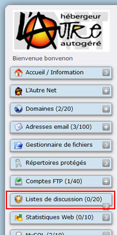

Depuis Le bureau virtuel, dans le menu de gauche, cliquer sur le lien "Listes de discussion (0/20)".

Sur ce compte, aucune liste de discussion n'existe.
L'information s'affiche dans la partie droite du bureau virtuel.  

Pour créer une liste cliquer sur le lien "Créer une nouvelle liste".

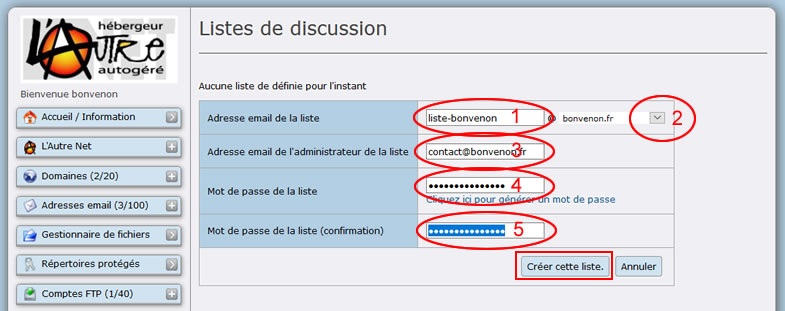

Choisir un nom de liste (Ovale Rouge 1) et, si plusieurs noms de domaine sont installés sur le compte AlternC, préciser celui auquel la liste est rattachée. Utiliser pour cela le menu déroulant avec la flèche noire (Ovale Rouge 2).  

Préciser l'adresse mail du gestionnaire de la liste (Ovale Rouge 3).

Saisir et confirmer le mot de passe de la liste (Ovale Rouge 4 et 5)

Enfin cliquer sur le bouton "Créer cette liste"

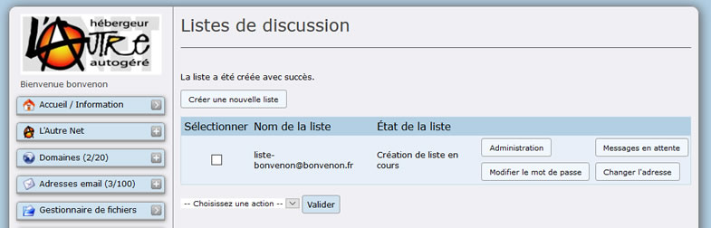

Attention, Mailman n'accepte pas que deux listes portent le même nom sur un même serveur tous comptes lautre.net confondus.  
Si le nom choisi est déja utilisé, un message d'erreur s'affiche.

Exemple si nous essayons de créer une liste "aide" :

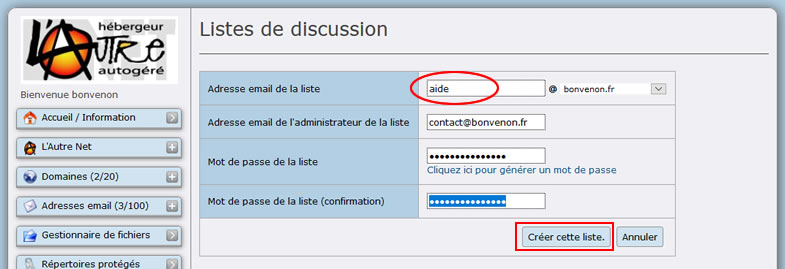

Nous obtenons le message d'erreur "Une liste avec ce nom existe déjà ..."(Ovale Rouge) :

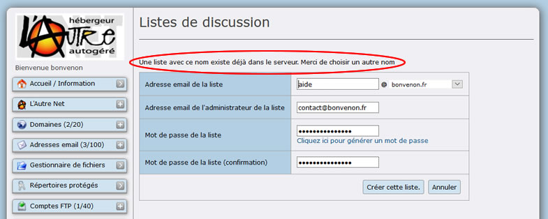

Mais rassurez-vous, si vous tenez particulièrement à votre nom de liste, [Une solution existe](http://aide.lautre.net/04-imposer-son-nom-de-liste.html).

Le propriétaire de la liste doit disposer d'une adresse électronique valide.
Le mot de passe doit être choisi avec soin et mémorisé (il n'est pas possible de le retrouver car, par souci de confidentialité, il est crypté MD5 sur le serveur).

Lorsque la liste est créée le tableau ci-dessous s'affiche dans la partie droite du bureau virtuel AlternC et précise que la création a été effectuée ("état de la liste" OK).

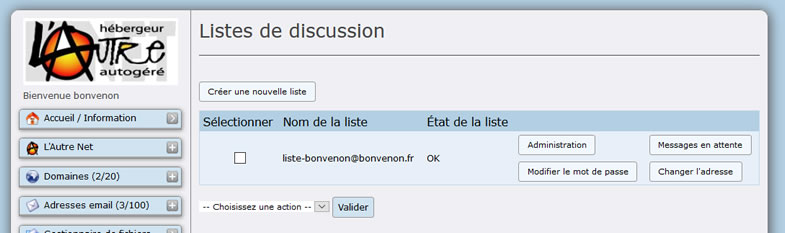

Depuis ce tableau il est possible

- **à partir du menu déroulant et du bouton "Valider" :**
 -  de supprimer la liste.  
 pour cela cocher la case "Sélectionner" correspondante choisir "DELETE" dans le menu déroulant et cliquer sur le bouton "Valider", une confirmation sera demandée.
 -  de régénérer une liste  
 pour cela cocher la case "Sélectionner" correspondante choisir "REGENERATE" dans le menu déroulant et cliquer sur le bouton "Valider", une confirmation sera demandée.
- **à partir des boutons** 
 -  d'accéder à l'administration de la liste (pour fixer ou modifier sa configuration, authentification nécessaire),
 -  de visualiser et gérer les éventuels messages en attente (authentification nécessaire),
 - de modifier le mot de passe

Toute liste doit être configurée avec soin en fonction d'objectifs bien définis. 
Nous allons étudier plusieurs cas dans les chapitres suivants.
Bien évidemment les possibilités offertes par Mailman étant très nombreuses, nous choisirons trois cas classiques :

- Liste de diffusion,
- Liste de discussion privée,
- Liste de discussion publique.

## Les 3 types de listes

Nous proposons, dans ce document, la configuration de trois types de liste.  
Il ne s'agit que de suggestions, l'objectif étant la prise en main des focntions de base de l'interface d'administration des listes Mailman.  
Bien évidemment, ces options peuvent être adaptées à vos besoins propres.

**Une liste de diffusion** est destinée à envoyer des informations et non à échanger des informations. C'est à dire qu'une ou plusieurs personnes peuvent poster des messages pour des abonnés qui, eux, ne peuvent pas écrire à cette liste.

*Objectifs* :

  -  Cette liste est privée, fermée à toute inscription et envois extérieurs.
  -  Elle émet des informations strictement réservées à un groupe d'abonnés.
  -  Les abonnés ne sont pas autorisés à répondre ou à communiquer via cette liste.
  -  Le gestionnaire de cette liste est le seul à pouvoir poster sur cette liste.
  -  Aucun message en attente ne doit encombrer inutilement l'hébergeur, aucun pied de message ne doit être visible.

**Une liste de discussion privée** est destinée à l'échange d'informations entre abonnés de cette liste.

*Objectifs* :

  -  Cette liste est privée, fermée à toute inscription et envois extérieurs.
  -  L'échange d'informations est strictement réservé à un groupe d'abonnés.
  -  Les abonnés communiquent via cette liste.
  -  Le gestionnaire de cette liste valide les inscriptions et peut modérer tel ou tel abonné.
  -  Tout abonné peut consulter la liste des abonnés, les archives, changer son mot de passe et modifier la manière dont il reçoit les messages.

**Une liste de discussion publique** est destinée à l'échange d'informations entre abonnés de cette liste. Les différences essentielles avec la liste de discussion privée sont l'accès public à la liste, l'inscription ouverte à tous, les archives publiques.

*Objectifs* :

  -  Cette liste est publique, ouverte à toute inscription.
  -  Les abonnés communiquent via cette liste.
  -  Le gestionnaire de cette liste est informé des inscriptions/désinscriptions. Il peut modérer tel ou tel abonné.
  -  Tout abonné peut consulter la liste des abonnés, les archives, changer son mot de passe et modifier la manière dont il reçoit les messages.
  -  Les archives sont publiques et consultables par tous.

Nous allons, au préalable décrire les manipulations communes à tout type de liste.

## Accéder à l'interface d'administration de la liste

Pour accéder à l'interface d'administration de la liste deux possibilités :

- utiliser le bouton "Administration" dans le bureau virtuel 
- inscrire l'URL ci-dessous dans la fenêtre d'un navigateur
https://listes.lautre.net/cgi-bin/mailman/admin/NomDeLaListe  
Ici NomDeLaListe doit être remplacé par le nom de votre liste.  
Attention, ne pas oublier le "s" de "https" qui vous garantit une connexion sécurisée et donc le passage des données sur le réseau dans un tunnel crypté.

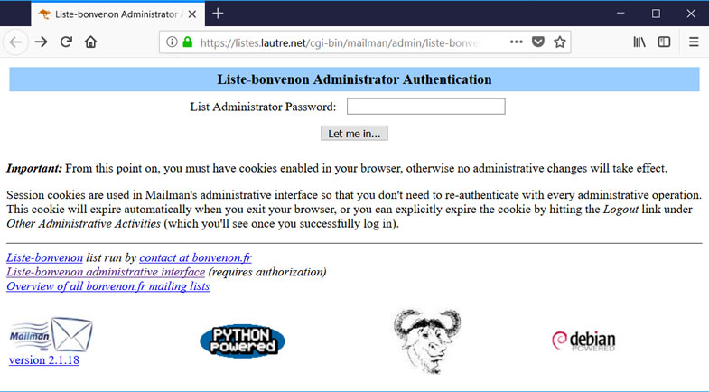

Au premier lancement le langage par default est "English"
Il faudra donc mettre "Français" dans notre cas. Ce que nous allons faire dès l'entrée dans l'interface d'administration.

Il est nécessaire de s'authentifier en inscrivant le mot de passe dans la case blanche.  
Attention, toujours dans un souci de confidentialité, le mot de passe ne s'inscrira pas en clair sur l'écran mais sous forme d'étoiles (***).  
Cliquer sur "Let me in ..." (que nous pourrions traduire par "connectez-moi").

La fenêtre qui s'ouvre est trop grande pour être reproduite ici, ci-dessous nous ne présentons que le menu général.

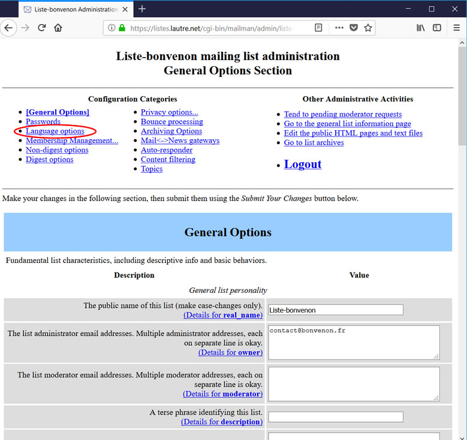

## Choix de la langue

La configuration du langage par défaut utilisé par la liste se fait en deux étapes.

**1 - Ajouter la langue française au menu de choix de langages**

Cliquer sur le lien "Language options" dans la colonne de gauche du menu général.  
Dans un premier temps il ne sert à rien d'utiliser le menu déroulant de droite qui offre, pour le moment, un unique choix : "English (USA)".

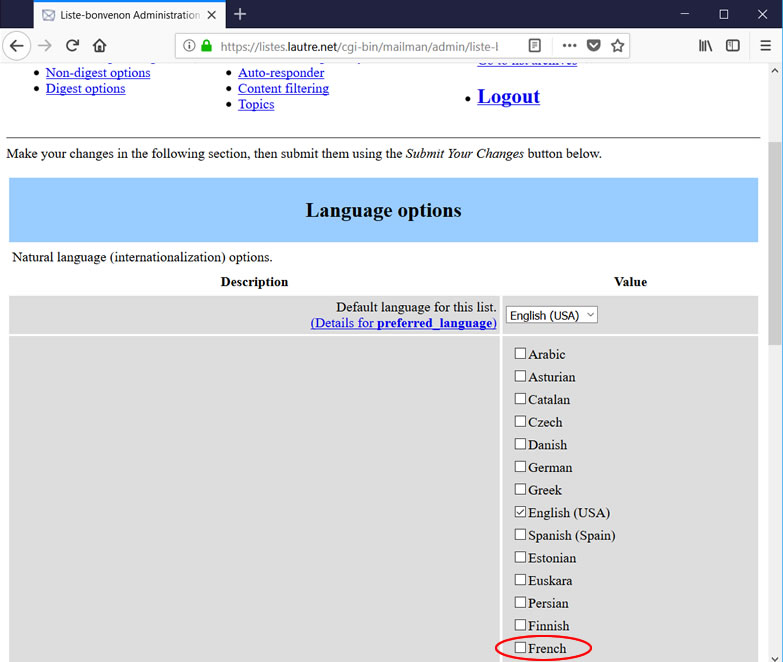

Il est nécessaire d'ajouter le langage choisi.
Pour cela, cocher la case "French" (Ovale Rouge).  
Puis de valider le choix, tout au bas de la fenêtre en cliquant sur le bouton "Submit Your Changes" (Rectangle Rouge) 

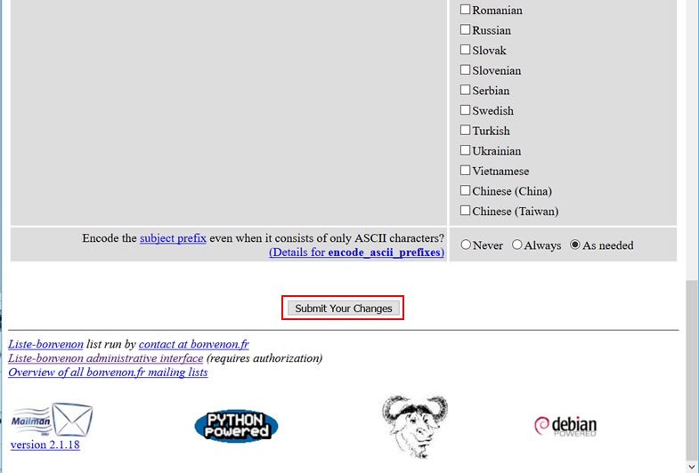

Si vous décochez "English" toutes les listes associées au nom de domaine "*bonvenon*.fr" seront par défaut en français.

**2 - Configurer la liste pour la langue française**

La validation de la première étape a pour effet l'affichage de la même page, toujours en anglais.

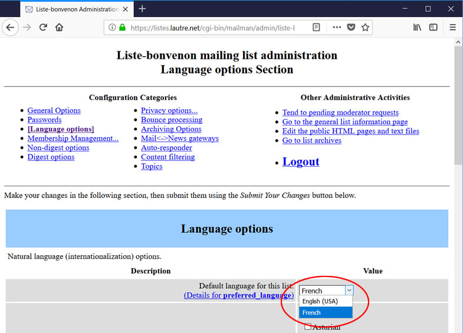  

Toutefois, maintenant, il est possible de sélectionner "French" dans le menu déroulant.  
Après sélection, ne pas oublier de valider en cliquant sur le bouton "Submit Your Changes".

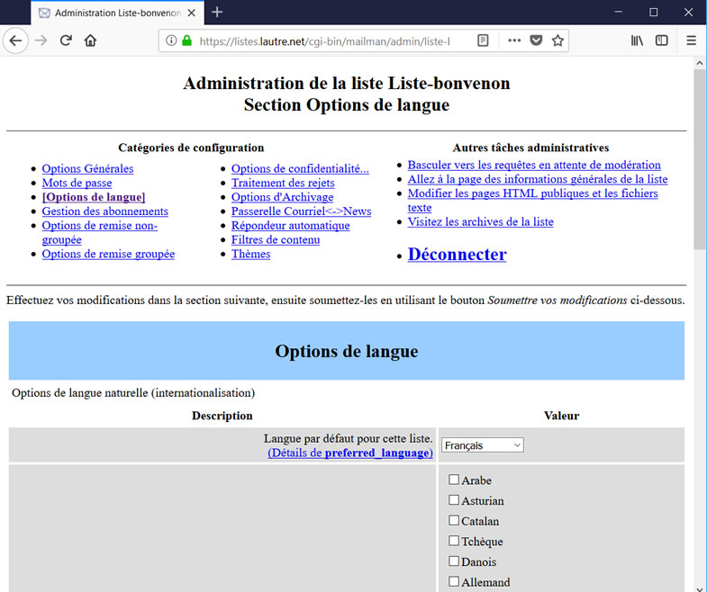  

La même page s'affiche à nouveau, cette fois en français.  
Cette manipulation est la même quelle que soit le type de liste choisi.