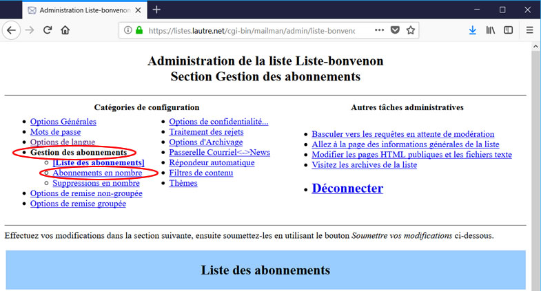
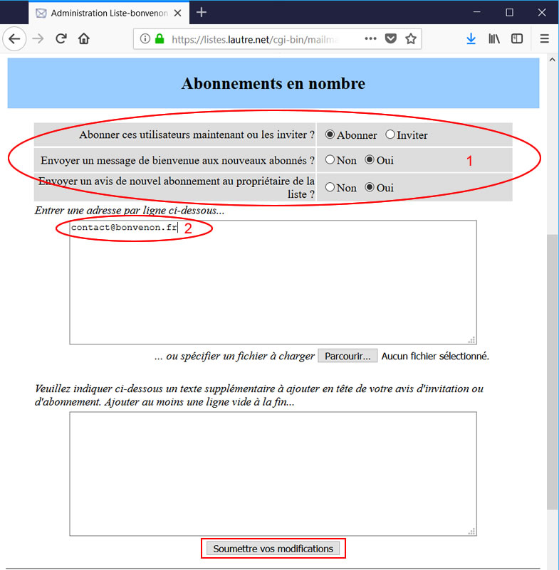
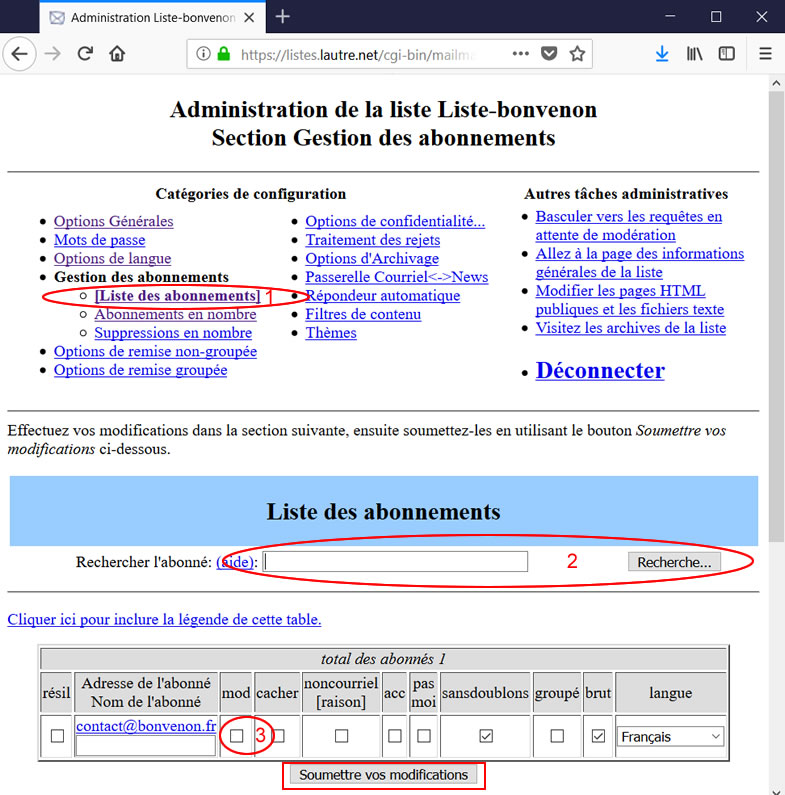

Title: 03. Configurer la liste 
Date: 2018-10-07 08:57:25
Category: 07. Gestion listes de discussion
Tags: old
Summary: Comment choisir entre toutes les options proposées par mailman celles qui vous conviennent.

## Abonner l'administrateur (ou gestionnaire) de la liste (2 étapes)

Attention, l'administrateur n'est pas automatiquement abonné à la liste qu'il gère. Nous allons donc l'abonner, ce n'est pas obligatoire mais préférable ici.

Dans le menu général cliquer sur le lien "*Gestion des abonnements*" (4ème ligne, 1ère colonne) puis sur "*Abonnements en nombre*" (Ovales Rouges). 

 
Modifier les valeurs comme suit :

Cocher les cases comme indiqué (Ovale Rouge 1).

Inscrire dans le cadre vide "contact@*bonvenon*.fr" (Ovale Rouge 2).

Puis soumettre les modifications en cliquant sur le bouton "Soumettre vos modifications" (Rectangle Rouge).  

Nous modifierons ces options par la suite pour la gestion des abonnés, en fonction du type de liste choisi.

Ensuite dans le menu "*Gestion des abonnements*", cliquer sur "*Liste des abonnements*" (Ovale Rouge 1).

Vous pouvez inscrire le nom de l'abonné à rechercher puis cliquer sur le bouton "Recherche..." (Ovale Rouge 2).

Vous devez décocher la case "*mod*" (modéré) afin que l'administrateur de la liste puisse écrire (Ovale Rouge 3).

Enfin cliquer sur le bouton "Soumettre vos modifications" (Rectangle Rouge).

Il est possible de permettre à l'administrateur, ou a toute autre personne, d'écrire à la liste sans être abonné. Nous détaillerons cette option par la suite.

ATTENTION avant de procéder à l'inscription des abonnés il est nécessaire

- d'avoir défini le type de liste comme indiqué dans l'introduction  
- de configurer cette liste en fonction des points choisis. Les éléments fournis ci-dessous ne sont pas nécessairement suffisants, ou ne répondent pas parfaitement à vos objectifs. Mailman offre de très nombreuses options, notre objectif est uniquement de vous aider à sa prise en mains.

Il est possible de régler déjà un certain nombre d'options.

Pour éviter de surcharger notre texte avec des copies d'écran de trop grande taille, nous vous proposons des tableaux reproduisant des lignes de l'interface administrateur.  
Une ligne titre, ajoutée par nos soins sur ce document permet de différencier les réponses selon le type de liste choisi.

## Rendre cette liste publique ou privée (deux étapes)

**1 - Dans le menu général cliquer sur le lien "*Options de confidentialité...*"** (en haut 2ème colonne) et modifier les valeurs comme indiqué sur les tableaux ci-dessous.

*Abonnement en cours*
<table>
    <thead>
        <tr>
            <th>Type de liste</th>
            <th align="center">Diffusion</th>
            <th align="center">Discussion Privée</th>
            <th align="center">Discussion Publique</th>
        </tr>
    </thead>
    <tbody>
        <tr>
            <td>Afficher cette liste lorsqu'on demande les listes hébergées par cette machine ?</td>
            <td align="center">NON</td>
            <td align="center">NON</td>
            <td align="center">OUI</td>
        </tr>
        <tr>
            <td>Quelles sont les étapes requises pour un abonnement ?</td>
            <td align="center">Nécessite une approbation</td>
            <td align="center">Nécessite une approbation</td>
            <td align="center">Confirmer</td>
        </tr>
        <tr>
            <td>L'approbation du modérateur de la liste est nécessaire pour les demandes de résiliation ? (Non est recommandé)</td>
            <td align="center" colspan=3>NON [1]</td>
        </tr>
    </tbody>
</table>
[1] ceci est fondamental au regard de la loi, chacun peut refuser d'être inscrit sur une liste de discussion ou de diffusion  

*Protection des abonnés*
<table>
    <thead>
        <tr>
            <th>Type de liste</th>
            <th align="center">Diffusion</th>
            <th align="center">Discussion Privée</th>
            <th align="center">Discussion Publique</th>
        </tr>
    </thead>
    <tbody>
        <tr>
            <td>Qui peut voir la liste des abonnés ?</td>
            <td align="center">Uniquement l'administrateur</td>
            <td align="center" colspan=2>Abonnés de la liste [1]</td>
        </tr>
        <tr>
            <td>Afficher les adresses des abonnés de façon à ce qu'elles n'apparaissent pas comme des adresses courriels ?</td>
            <td align="center">OUI [2]</td>
            <td align="center">OUI</td>
            <td align="center">OUI</td>
        </tr>
    </tbody>
</table>
[1] Même si une liste est publique, il vaut mieux éviter de rendre la liste des abonnés publique (spams)  
[2] ci cela à peu d'importance puisque la liste des abonnés n'est accéssible qu'au seul administrateur, mais c'est une bonne habitude à prendre !

**2 - Dans le menu général cliquer sur le lien "*Options d'archivage*"** (3ème ligne, 2ème colonne) et modifier les valeurs comme suit :

<table>
    <thead>
        <tr>
            <th>Type de liste</th>
            <th align="center">Diffusion</th>
            <th align="center">Discussion Privée</th>
            <th align="center">Discussion Publique</th>
        </tr>
    </thead>
    <tbody>
        <tr>
            <td>Messages archivés ?</td>
            <td align="center">OUI</td>
            <td align="center">OUI</td>
            <td align="center">OUI ou NON</td>
        </tr>
        <tr>
            <td>Le fichier source des archives est destiné à un archivage public ou privé ?</td>
            <td align="center">Privé</td>
            <td align="center">Privé</td>
            <td align="center">Public</td>
        </tr>
        <tr>
            <td>Avec quelle périodicité de nouveaux volumes d'archives doivent-ils être crées ?</td>
            <td align="center" colspan=3>(choisir en fonction de vos convenances)</td>
        </tr>

    </tbody>
</table>

ATTENTION : Ne jamais oublier de valider les modifications en cliquant sur le bouton "Soumettre vos modifications".

## Gérer l'envoi et la réception des messages

Dans le menu général cliquer sur le lien "*Options de confidentialité...*" (en haut 2ème colonne) puis sur le lien "*Filtres expéditeurs*" et modifier les valeurs comme suit :

*Filtres d'abonné*
<table>
    <thead>
        <tr>
            <th>Type de liste</th>
            <th align="center">Diffusion</th>
            <th align="center">Discussion Privée</th>
            <th align="center">Discussion Publique</th>
        </tr>
    </thead>
    <tbody>
        <tr>
            <td>Les envois des nouveaux abonnés doivent être modérés par défaut ?</td>
            <td align="center">OUI</td>
            <td align="center">NON ou OUI</td>
            <td align="center">NON</td>
        </tr>
        <tr>
            <td>Mesure à prendre lorsqu'un abonné sous modération envoie un message à la liste.</td>
            <td align="center">Rejeter</td>
            <td align="center">En attente</td>
            <td align="center">En attente</td>
        </tr>
        <tr>
            <td>Texte à inclure dans les avis de rejet à envoyer aux abonnés sous modération ayant soumis un message à la liste</td>
            <td align="center">Exemple de texte ci-après</td>
            <td align="center" colspan=2>Ne rien inscrire ici un mail automatique est envoyé</td>
        </tr>        
    </tbody>
</table>

Exemple de texte à inscrire dans les avis de rejet pour les listes de diffusion :

*Ceci est un message automatique. 
Votre envoi ne peut pas être transmis aux abonnés de cette liste de diffusion (et non de discussion) 
Si vous souhaitez joindre l'administrateur de cette liste écrivez à contact@*bonvenon*.fr

*Filtres de non-abonné (dernière ligne)*
<table>
    <thead>
        <tr>
            <th>Type de liste</th>
            <th align="center">Diffusion</th>
            <th align="center">Discussion Privée</th>
            <th align="center">Discussion Publique</th>
        </tr>
    </thead>
    <tbody>
        <tr>
            <td>Les messages des non-abonnés automatiquement ignorés doivent être transmis au modérateur de la liste ?</td>
            <td align="center">NON</td>
            <td align="center"></td>
            <td align="center"></td>
        </tr>
    </tbody>
</table>