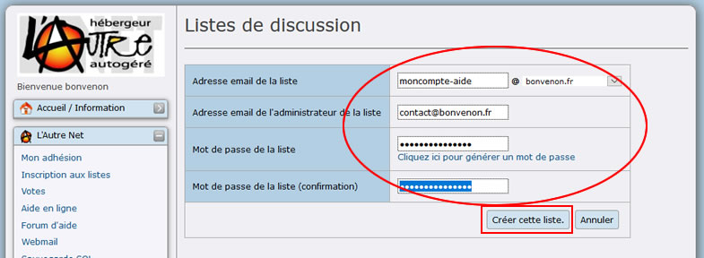
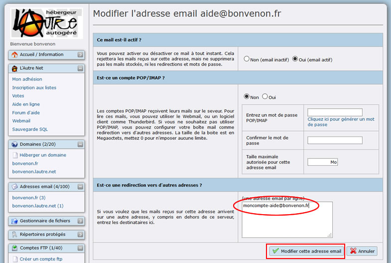
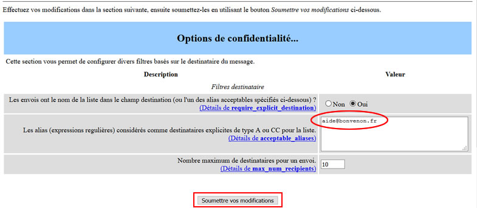
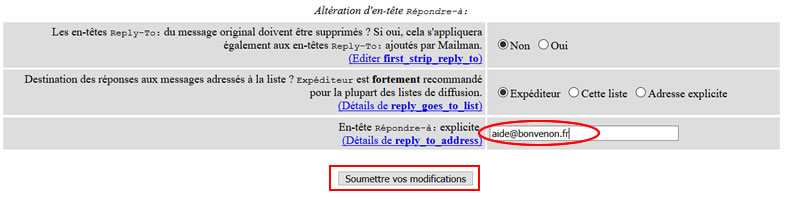

Title: 04. Imposer son nom de liste 
Date: 2018-10-06 18:38:53
Category: 07. Gestion listes de discussion
Tags: old
Summary: Comment créer une liste de diffusion avec le nom de votre choix, alors même que Mailman vous en refuse la création. . 

Vous avez sans doute tenté de créer une liste, et vous avez obtenu le message d'erreur suivant (Ovale Rouge) :

Un nom de liste utilisé par un membre hébergé sur le serveur de Lautre.net ne peut pas être réutilisé pour une autre liste (même avec un nom de domaine différent) sur le même serveur.
C'est une limitation de Mailman.

En revanche, que ce soit pour votre domaine hébergé sur Lautre.net ou pour votre compte en login.lautre.net, il vous est possible de créer une adresse email qui soit utilisée comme nom de votre liste. Voici comment faire :

Dans l'exemple qui suit, le nom de liste que nous allons tenter de créer est aide@*bonvenon*.fr

**Etape 1** : créer une liste moncompte-aide@*bonvenon*.fr… (ou tout autre nom n'existant pas déjà) ;

**Etape 2** : dans les comptes mails de votre domaine ou de votre compte créer une adresse sans pop qui envoie aide@*bonvenon*.fr… vers moncompte-aide@*bonvenon*.fr… ;

**Etape 3** : dans la configuration de la liste, dans "Options de confidentialité" puis "Filtre destinataire", ajouter l'adresse aide@*bonvenon*.fr… comme adresse alternative de la liste (cela évite de devoir systématiquement modérer les messages que mailman considère en destination implicité) ;

**Etape 4** : dans le cas où l'on souhaite un reply-to sur la liste, on peut indiquer l'adresse aide@*bonvenon*.fr… comme adresse explicite de réponse, dans les "Options générales".

