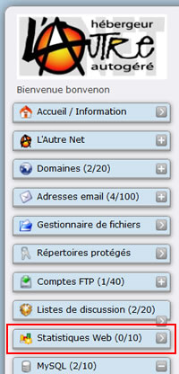
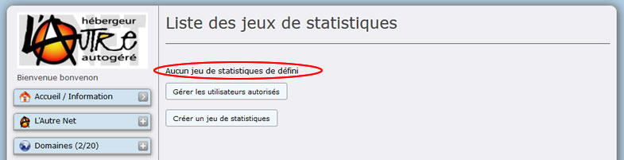
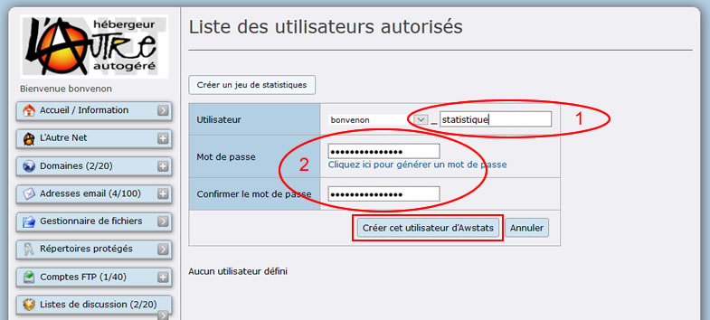
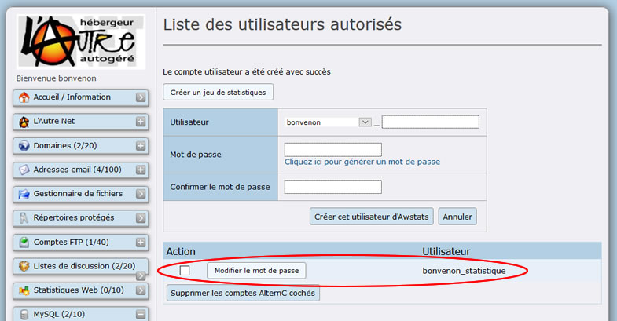
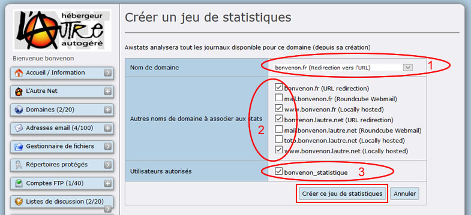
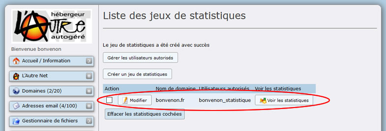

Title: 01. Créer un jeu de statistiques 
Date: 2018-10-07 17:01:48
Category: 08. Gestion des statistiques
Tags: old
Summary: Gestion des statistiques.  

AWSTATS permet un affichage mois par mois, des statistiques concernant les page visitées du site, ainsi que la configuration des clients qui s'y sont connectés en donnant un relevé des navigateurs et système d'exploitation utilisés par les clients.  
Il est nécessaire de créer un ou plusieurs couples "nom d'utilisateur/mot de passe" qui serviront à protéger la confidentialité des statistiques. Pour cette documentation nous utiliserons un compte de test "statistique".

## Menu Statistiques Web

Pour accéder à la création de jeux de statistiques, cliquer dans le menu du bureau virtuel sur le lien "Statistiques Web"

Dans la partie droite du bureau virtuel apparaissent deux boutons et une information : "Aucun jeu de statistiques de défini" (Ovale Rouge).

Nous allons en créer

## Créer des utilisateurs

Pour ajouter un premier utilisateur cliquer sur le bouton "Gérer les utilisateurs autorisés".

Le champ "Utilisateur" comporte obligatoirement, soit le nom du compte, soit un nom de domaine installé sur ce compte, utiliser le menu déroulant accessible depuis la flèche noire à droite du champ nom.  
Il est possible d'ajouter à sa suite un autre mot (non accentué). Ceci permet de créer plusieurs utilisateurs (Ovale Rouge 1).  
Choisir un mot de passe ou laisser vide si les statistiques sont publiques (Ovale Rouge 2).  
Valider en cliquant sur le bouton "Créer cet utilisateur d'Awstats" (Rectangle Rouge).

Après l'ajout de l'utilisateur, la liste des utilisateurs autorisés mentionnera l'utilisateur créé (ici documentation).

Faire de même pour créer les autres utilisateurs.  

## Créer un jeu de statistiques

La création du jeu de statistiques se fait également depuis le lien du menu « *Statistiques web* » puis choisir le lien "Créer un jeu de statistiques".

Le formulaire de création du jeu de statistiques propose le choix entre les domaines ou sous-domaines installés sur ce compte (Ovale Rouge 1). 

Rajouter les domaines et sous-domaines que vous souhaitez voir inclus dans les statistiques (Ovale Rouge 2).

Vous devez désigner au moins un utilisateur qui aura le droit d'accéder à ces statistiques en cochant la case précédant le nom de l'utilisateur (Ovale Rouge 3).  

Le jeu de statistiques est créé, il figure dans la liste des jeux de statistiques.  

À tout moment il est possible de le modifier en cliquant sur le bouton "Modifier" ou de le supprimer en cochant la case "Action" puis en cliquant sur le bouton "Effacer les statistiques cochées".

Un clic sur le bouton "Voir les statistiques" à la suite du nom du jeu de statistiques ouvre une page sur laquelle tous les chiffres sont à zéro, c'est normal.  
Avant de visualiser les statistiques, il faut attendre 48 heures voire quelques jours pour que les visites réalisées par les internautes soient comptabilisées.  
En effet, AWSTATS parcourt chaque nuit les fichiers journaux du serveur web apache pour mettre en forme et stocker les statistiques de l'avant-veille.   
Nous utiliserons donc des tableaux fictifs pour la description des fonctionnalités de AWSTATS.

## Visualiser les stats sans passer par le bureau

On crée un ou des utilisateurs avec nom d'utilisateur et mot de passe afin de leur permettre une consultation des statistiques sans avoir l'accès au bureau virtuel.

Il suffit de donner l'url, leur nom d'utilisateur et mot de passe à ces utilisateurs.  
Pour aller vite, cliquer sur "Voir les statistiques" depuis le bureau et recopier l'url...  

C'est une url de type :  
https://admin\.lautre.net/cgi-bin/awstats.pl?config=*bonvenon*.fr

