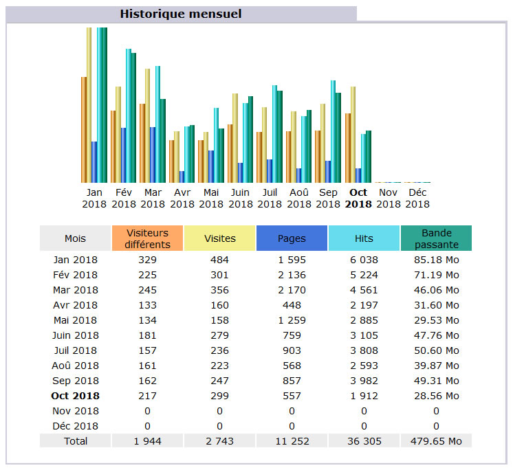
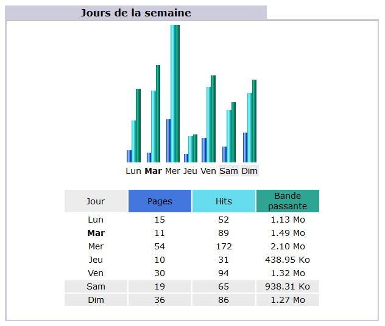
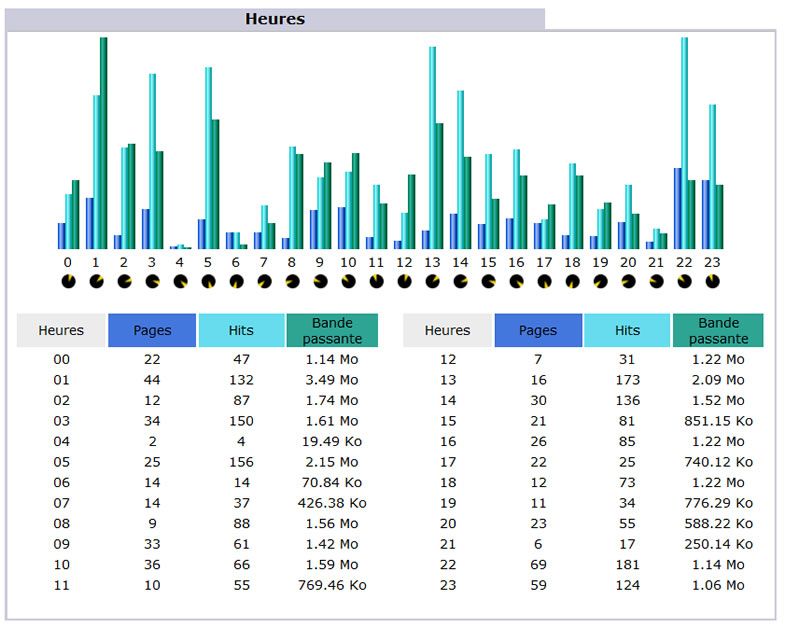

Title: 03. Quand 
Date: 2018-10-05 21:14:51
Category: 08. Gestion des statistiques
Tags: old
Summary: Les heures de visite de notre site.

## Historique mensuel 
L'historique mensuel relate mois par mois, les statistiques de consultation du site web, d'abord sous la forme d'un histogramme puis sous la forme d'un tableau de chiffres.

Par exemple pour octobre 2018 :
217 visiteurs ont réalisé 299 visites pendant lesquelles ils ont vu 557 pages et cliqué sur 1912 liens, ce qui a généré un trafic de 28,56 Mo. 

## Statistiques par jour du mois

La rubrique suivante affiche le nombre de visites et les statistiques qui s'y rapportent par jour du mois sélectionné. Les jours, sur fond grisé, représentent les samedis et les dimanches.

L'affichage est réalisé d'abord sous la forme d'un histogramme puis ensuite sous la forme d'un tableau de chiffres.

Par exemple, le 21 octobre, il y a eu 20 visiteurs qui ont vu 35 pages en actionnant 162 liens, ce qui a généré un trafic de 2,37 Mo.

## Statistiques par jour de la semaine

L'affichage des statistiques par jour de la semaine, donne le trafic moyen par jour de la semaine, en réalisant une moyenne des visites pour tous les lundis du mois, puis pour tous les mardi, etc ...

L'affichage se présente encore une fois d'abord sous la forme d'un histogramme puis sous la forme d'un tableau affichant:

  -  Le nombre de pages visitées en moyenne pour chaque jour
  -  Le nombre moyen de hits pour chaque jour
  -  La bande passante consommée par jour

Par exemple, dans notre cas,  le pic de visites  en terme de nombre de pages téléchargées et de consommation de bande passante– se situe le mercredi.

## Statistiques moyenne par heure de la journée
Comme pour les statistiques par jour de la semaine, les statistiques par heure de la journée sont le résultat d'une moyenne des statistiques du site pour chaque tranche horaire d'une heure.

Présentées, d'abord sous la forme d'un histogramme, puis sous la forme d'un tableau de valeurs, elle donne, dans notre exemple, les informations suivantes :
Le pic du nombre de page téléchargées se situe dans la tranche de 22 h à 23 h, alors que le pic pour le trafic généré se situe entre 1 h et 2 h.