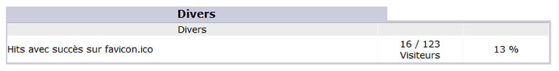
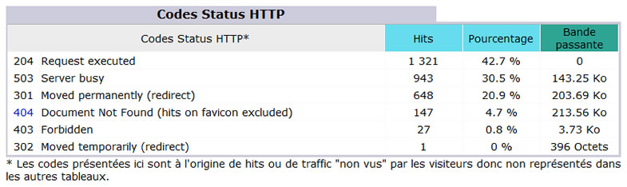

Title: 07. Autres 
Date: 2018-10-01 22:19:15
Category: 08. Gestion des statistiques
Tags: old
Summary: Quelques éléments inclassables dans les catégories précédentes. . 

## Divers

Les divers nous informent avec plus ou moins de fiabilité sur les capacités des navigateurs des visiteurs en particulier, si ceux ci possèdent les greffons (plugins) nécessaires à la lecture de médias flash, java, pdf ...

## Codes status HTTP

Les "codes status HTTP" regroupent les codes d'erreur éventuellement rencontrés par les usagers du site web, ceux ci ne sont pas comptabilisés dans les statistiques du site. En nous reportant au résumé, nous pouvons voir que ces codes correspondent au « Trafic non vu ».

